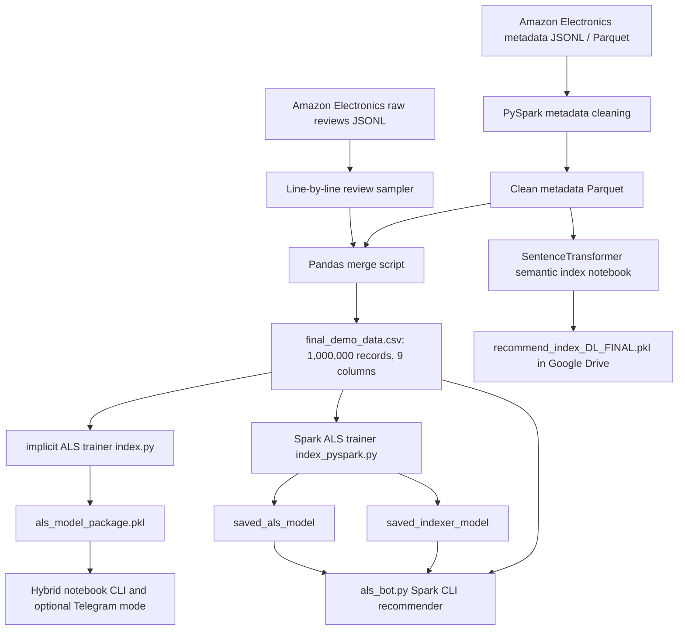

# Project Knowledge Base: Hybrid Amazon Recommendation Bot

**One-line description:** Hybrid Amazon Recommendation Bot is an academic big-data recommender system that processes Amazon Electronics review and product metadata, trains collaborative filtering and semantic/content models, and serves recommendations through CLI-oriented bot code with prepared Telegram integration.

**Keywords:** Hybrid Amazon Recommendation Bot, Amazon Electronics recommender, Amazon Reviews 2023, PySpark ETL, Spark MLlib ALS, Alternating Least Squares, collaborative filtering, content-based filtering, semantic search, SentenceTransformers, all-MiniLM-L6-v2, TF-IDF alternative, recommendation bot, CLI bot, Telegram bot, zero database, Parquet model, Pickle model package, StringIndexer, cold start, user ID recommendation, natural language query, price filter, brand filter, big data, low RAM VM, Google Colab, CISC3018

# Section 1: Project Identity

## 1.1 What This Project Is

Hybrid Amazon Recommendation Bot is a course project for CISC3018 Cloud Computing and Big Data Systems. The project builds a recommendation pipeline for the Amazon Electronics 2023 dataset using Python, PySpark, Spark MLlib ALS, and experimental semantic search code. The project is stored as an archive rather than a conventional software repository: there is no package manifest, no `.git` directory, no CI configuration, and no application framework.

Hybrid Amazon Recommendation Bot has three implementation layers. The first layer is data engineering: JSONL and Parquet metadata are read, cleaned, sampled, merged, and saved to `final_demo_data.csv`. The second layer is model training: one path uses the `implicit` Python library to train a local ALS model and pickle it, while another path uses Spark MLlib ALS and Spark `StringIndexer` models saved as Parquet-backed Spark ML artifacts. The third layer is serving: notebooks and `als_bot.py` expose an interactive CLI bot, and the notebooks include optional Telegram bot scaffolding.

The project also includes final academic deliverables: a 33-page report PDF/DOCX, a PowerPoint deck, and rendered screenshots of every report page. Those documents describe the target system as a lightweight, zero-database hybrid recommender designed to run under a low-resource 3GB RAM Ubuntu VM constraint, with Google Colab used when local VM memory became insufficient.

## 1.2 Problem It Solves

Hybrid Amazon Recommendation Bot addresses **e-commerce information overload**: Amazon Electronics users face many products, noisy titles, missing metadata, and broad keyword results. The project attempts to return relevant electronics recommendations from either an existing Amazon reviewer user ID or a free-text query such as "wireless headphones under 100" or "gaming laptop under 1500 from Lenovo".

Hybrid Amazon Recommendation Bot also addresses a **resource-constrained big-data processing problem**. The project report frames the raw Amazon review and metadata inputs as multi-gigabyte JSON data that are too large for a small VM with about 3GB of RAM. The implemented solution therefore uses line-by-line JSON reading, PySpark distributed processing, Parquet/CSV materialization, and model serialization so the final bot can load precomputed assets rather than a database.

Concrete scenarios covered by the code include:

| Scenario | How Hybrid Amazon Recommendation Bot handles it |
|---|---|
| Existing reviewer asks for personalized products | `als_bot.py` loads Spark ALS and indexer models, maps the string `user_id` to `user_index`, calls `recommendForUserSubset`, and joins item indices to product titles. |
| Demo user enters a raw Amazon-like user ID in notebook | `ALS_bot_user_ID_and_search_query_both(1).ipynb` routes user-ID-shaped input to `als_recommend`. |
| User enters a natural language product query | The notebooks route text to either content title matching or SentenceTransformer embedding similarity. |
| Product metadata is missing | `ETL Pipeline.py` fills `image_url` with `None`; bot code skips missing titles in the Spark path and prints `N/A` for missing prices in some paths. |
| VM memory is insufficient | The report and notebooks show migration to Google Colab with a T4 GPU for embedding and model training work. |

## 1.3 Target Users

Hybrid Amazon Recommendation Bot targets three user groups: course evaluators, project demonstrators, and prospective interviewers reviewing the candidate's big-data engineering work. The end-user-facing target is an electronics shopper who wants product recommendations from either historical behavior or natural language constraints.

The project report describes a primary Telegram Bot interface and a fallback Command-Line Interface. The source code confirms that the delivered runnable interface is primarily CLI-based. Telegram integration is present in notebooks behind `mode == "telegram"`, but the token placeholders `YOUR_BOT_TOKEN` and `YOUR_BOT_TOKEN_HERE` show that Telegram deployment was prepared rather than finalized in this archive.

The data-engineering target user is a developer or student who needs to process Amazon Reviews 2023 data, convert noisy JSONL metadata into compact Parquet, merge user reviews with product metadata, and produce serialized recommendation assets without operating a database server.

## 1.4 Project Status

Hybrid Amazon Recommendation Bot is an **archived completed academic project**, not an active application repository. This status is derived from the workspace structure and file metadata: there is no `.git` directory, no package manager metadata, no CI/CD directory, no tests, and no current development branch. The final report PDF was created on 2025-12-14, and the newest meaningful source file is `als_bot.py`, modified on 2026-03-02, likely during archive cleanup or later adjustment.

The available timeline comes from file modification dates rather than Git history. The first source artifact is `split jsonl.py` from 2025-11-23. Most training, ETL, model, and notebook artifacts were created or modified on 2025-12-11. The report, screenshots, and presentation were finalized on 2025-12-14. The `.DS_Store` files and `als_bot.py` show 2026-03-02 filesystem activity. Because no `.git` directory exists, commit-level authorship, branch history, tags, and refactor diffs cannot be recovered from this workspace.

# Section 2: Technology Stack

## 2.1 Languages and Versions

Hybrid Amazon Recommendation Bot uses **Python** as the primary language, with Python versions inferred from notebooks and logs rather than a formal runtime constraint file. The standalone scripts are plain Python scripts without type hints or package-level entry points.

| Language / runtime | Evidence | Version details | Role |
|---|---|---|---|
| Python | `.py` scripts and Jupyter notebooks | Notebook metadata shows Python 3.13.7 and 3.13.5 for local kernels; Colab logs install Python 3.11.14; Colab runtime paths show Python 3.12 packages for SentenceTransformers. | ETL scripts, model training, CLI bot, notebook experiments. |
| PySpark / JVM | `jsonl_to_parquet.ipynb`, `index_pyspark.py`, `als_bot.py`, saved model metadata | Spark saved model metadata records Spark 4.0.1; notebooks install PySpark 4.0.1 and Py4J 0.10.9.9. | Distributed ETL, StringIndexer, ALS training, saved Spark model loading. |
| SQL-like Spark DataFrame API | PySpark imports and DataFrame transformations | No SQL engine version beyond Spark 4.0.1. | Schema-based JSON loading, column extraction, filtering, joins, recommendations. |
| Markdown / XML document formats | DOCX, PPTX, PDF, notebook JSON | Office artifacts created with Microsoft Word and PowerPoint. | Report and presentation deliverables. |

There are no `requirements.txt`, `pyproject.toml`, `environment.yml`, `Pipfile`, `conda` lock file, or Dockerfile in Hybrid Amazon Recommendation Bot. Reproducible versions must be reconstructed from notebooks, Colab outputs, and saved Spark metadata.

## 2.2 Frameworks and Libraries

Hybrid Amazon Recommendation Bot uses a mixture of production-like runtime libraries and notebook-only experiment libraries. The project does not separate dependencies into production and development manifests, so this inventory is inferred from imports and notebook installation logs.

| Dependency | Version evidence | Runtime category | Role in Hybrid Amazon Recommendation Bot |
|---|---:|---|---|
| PySpark | 4.0.1 in saved model metadata and Colab install output | Production/training | Spark sessions, CSV/JSON/Parquet processing, `StringIndexer`, `Pipeline`, Spark MLlib ALS, model saving/loading. |
| Spark MLlib ALS | Spark 4.0.1 metadata | Production/training | Collaborative filtering (matrix factorization, user-item recommendation). |
| Py4J | 0.10.9.9 from PySpark install output | Production/training | Bridge between Python and Spark JVM. |
| pandas | 2.3.3 in Colab install log for ALS notebooks; local version absent | Production/training | CSV loading, data frame manipulation, product catalog construction, Parquet loading in notebooks. |
| NumPy | 2.3.5 in ALS Colab venv, 2.0.2 in SentenceTransformers Colab environment | Production/training | Numeric arrays, quality score calculations, implicit ALS dependency. |
| SciPy | 1.16.3 in Colab install log | Production/training | Sparse CSR matrix via `scipy.sparse` for `implicit` ALS. |
| implicit | 0.7.2 installed in notebooks | Production/training | Local non-Spark ALS training in `index.py` and hybrid notebook. |
| pickle | Python standard library | Production/runtime | Serialization of the implicit ALS package and SentenceTransformer search index. |
| json | Python standard library | Production/ETL | Line-by-line JSONL parsing in `ETL Pipeline.py`. |
| pathlib / os / sys / shutil | Python standard library | Production/ops | Path handling, environment setup, Spark Python executable pinning, artifact deletion and zip packaging. |
| SentenceTransformers | 5.1.2 in notebook output | Experiment/runtime | Semantic text embedding using `all-MiniLM-L6-v2` for query-based product search. |
| transformers | 4.57.3 in notebook output | Transitive experiment | Transformer model loading for SentenceTransformers. |
| torch | 2.9.0+cu126 in notebook output | Experiment/training | GPU-backed embedding generation in Colab. |
| scikit-learn | 1.6.1 in notebook output | Experiment/runtime | `cosine_similarity` for query-to-product embedding ranking. |
| tqdm | 4.67.1 in notebook outputs | Development/training | Progress bars for embedding/model work. |
| python-telegram-bot | Installed conditionally in notebooks; no version recorded | Optional interface | Telegram `/start` command and text message handler scaffolding. |
| google.colab | Colab-specific import | Development/training | Mounting Google Drive and using Colab compute resources. |
| CUDA / NVIDIA T4 | `nvidia-smi` output shows Tesla T4, CUDA 12.4 | Development/training | GPU acceleration for SentenceTransformer embedding generation. |
| OpenJDK / Java | Colab PySpark install logs include OpenJDK 11 | Runtime dependency | Required by Spark. |

The code comments and report explain why PySpark and serialized files were chosen: PySpark handles the large Amazon dataset and Spark MLlib ALS; serialized Parquet/Pickle assets avoid a database; Google Colab was used when the VirtualBox VM exceeded memory limits. The report proposes TF-IDF, but the most concrete notebook implementation uses SentenceTransformers and cosine similarity for semantic search rather than a persisted TF-IDF vectorizer file.

## 2.3 External Services and Infrastructure

Hybrid Amazon Recommendation Bot depends on external data and optional hosted runtime services, but it does not depend on a deployed database, cache, queue, or cloud API at bot runtime in the archived code.

| External service / infrastructure | Evidence | Use |
|---|---|---|
| Amazon Reviews 2023 dataset | Report references McAuley Lab Amazon Reviews 2023; code references `Electronics.jsonl` and `meta_Electronics.jsonl`. | Source reviews and product metadata for Electronics recommender training. |
| Google Colab | Notebooks import `google.colab.drive`, mount `/content/drive`, and use T4 GPU output. | Training and embedding generation when local VM memory was insufficient. |
| Google Drive | Notebook paths such as `/content/drive/MyDrive/3018 project/meta_electronics.parquet`. | Storage of generated Parquet and Pickle files in Colab workflows. |
| Telegram Bot API | Notebook imports `telegram` and `telegram.ext`, uses placeholder tokens. | Optional future user interface for chat-based recommendations. |
| Ubuntu VirtualBox VM | Report describes 3GB RAM / 2-core VM constraint. | Intended low-resource local execution environment. |
| Hugging Face Hub | SentenceTransformers output warns about missing `HF_TOKEN`; model name `all-MiniLM-L6-v2`. | Public transformer model download/loading for embeddings. |

Hybrid Amazon Recommendation Bot explicitly follows a **zero-database strategy**. No PostgreSQL, MySQL, MongoDB, Redis, Kafka, S3, MinIO, Airflow, or REST service is configured in the workspace.

## 2.4 Development Tooling

Hybrid Amazon Recommendation Bot uses notebooks, scripts, and manual artifact inspection instead of formal development tooling. There are no linters, formatters, type checkers, unit-test runners, CI workflows, Dockerfiles, or Makefiles in the workspace.

| Tooling | Evidence | Role |
|---|---|---|
| Jupyter Notebook / Colab | Five `.ipynb` files | Interactive ETL, model training, environment setup, CLI demo output capture. |
| Microsoft Word | PDF metadata says created by Microsoft Word for Microsoft 365 | Final 33-page report authoring. |
| Microsoft PowerPoint | `.pptx` deck with 15 slides | Presentation deliverable. |
| Spark saved model writer | `saved_als_model` and `saved_indexer_model` directories | Persisted MLlib model artifacts. |
| CSV and Parquet artifacts | `final_demo_data.csv`, Spark model Parquet partitions | Data and model persistence without database infrastructure. |
| Pickle | `als_model_package.pkl` and notebook deep-learning pickle path | Python object serialization for model/package loading. |

The absence of tooling is itself an engineering fact for Hybrid Amazon Recommendation Bot: installation is notebook-driven, version pinning is partial, test automation is absent, and reproducibility depends on reconstructing the Colab/VM environment from captured outputs.

# Section 3: Architecture

## 3.1 High-Level Architecture

Hybrid Amazon Recommendation Bot is a batch-trained, file-backed recommender pipeline. The architecture starts with raw Amazon Electronics JSONL review and metadata files, extracts a manageable million-row demo dataset, trains ALS recommendation models, and serves recommendations from local serialized assets. The archived code contains both a Spark-native model path and a Python `implicit` model path.



The key architectural constraint in Hybrid Amazon Recommendation Bot is that the runtime bot does not connect to a live database. The bot loads precomputed model files, indexers, and product metadata from disk. This reduces deployment complexity but means retraining and refreshing data are offline batch operations.

## 3.2 Module / Package Breakdown

Hybrid Amazon Recommendation Bot is not organized as importable Python packages. The module breakdown is therefore file- and artifact-based rather than package-based.

### Data Ingestion and ETL Module

The Hybrid Amazon Recommendation Bot ETL module lives in `Project Archive/1 spilt json , clean and to parquet and ETL/`. Its purpose is to split large JSONL files, clean Amazon metadata using PySpark, and produce `final_demo_data.csv`.

Public API: no importable API. The module exposes runnable scripts and notebooks:

| File | Public behavior |
|---|---|
| `split jsonl.py` | Splits one hardcoded JSONL input into `reviews_chunks/part-0001.jsonl` style chunks. |
| `jsonl_to_parquet.ipynb` | Loads 22 metadata JSONL chunks with a Spark schema, extracts product fields, fills nulls, indexes `parent_asin`, and writes one Snappy Parquet output. |
| `ETL Pipeline.py` | Reads up to 1,000,000 review rows, filters metadata to matching `parent_asin`, merges reviews and metadata, and writes `final_demo_data.csv`. |

Internal dependencies: `ETL Pipeline.py` depends on a local `Electronics.jsonl` review file and a local Snappy Parquet metadata file named `part-00000-b2b7f235-6d34-4a9e-a125-ffe4d36cea34-c000.snappy.parquet`. The workspace does not include those raw inputs, but it includes the generated `final_demo_data.csv`.

### Local implicit ALS Module

The Hybrid Amazon Recommendation Bot local ALS module lives in `Project Archive/3 ALS (meta+review) bot - capable of user IDs and search query both type inputs/index.py` and the related `als_train_colab.ipynb` notebook. Its purpose is to train an `implicit.als.AlternatingLeastSquares` model from `final_demo_data.csv`.

Public API: no importable API. Running `index.py` reads `final_demo_data.csv`, converts `user_id` and `parent_asin` to categorical integer codes, builds a SciPy sparse user-item matrix, trains ALS with 50 latent factors, and writes `als_model_package.pkl`.

Internal structure: the pickle package contains `model`, `user_item_matrix`, `user_to_idx`, `item_map`, and `product_info`. That package is consumed by `ALS_bot_user_ID_and_search_query_both(1).ipynb`.

### Spark MLlib ALS Module

The Hybrid Amazon Recommendation Bot Spark ALS module lives in `index_pyspark.py`, `als_train_colab_pyspark.ipynb`, `saved_als_model/`, and `saved_indexer_model/`. Its purpose is to train a Spark MLlib ALS model and persisted StringIndexer pipeline on `final_demo_data.csv`.

Public API: no importable API. Running `index_pyspark.py` reads `final_demo_data.csv`, fits `StringIndexer` models for users and items, splits rows into training/test sets, trains `ALS(maxIter=10, rank=50, regParam=0.1, coldStartStrategy="drop", nonnegative=True)`, evaluates RMSE, demonstrates recommendations for sampled users, and saves the model and indexer.

Internal dependencies: `als_bot.py` depends directly on `saved_als_model`, `saved_indexer_model`, and `final_demo_data.csv` via paths computed relative to the bot script.

### Bot Serving Module

The Hybrid Amazon Recommendation Bot serving module is represented by `als_bot.py` and two notebooks. The concrete script `als_bot.py` serves Spark ALS recommendations for user IDs through an interactive CLI. The notebook `ALS_bot_user_ID_and_search_query_both(1).ipynb` adds a hybrid router that accepts either user IDs or text queries and includes optional Telegram code.

Public API in `als_bot.py`:

| Function | Contract |
|---|---|
| `init_spark()` | Creates a Spark session named `RecSysBot`. |
| `load_resources(spark)` | Loads the Spark PipelineModel, ALSModel, and product metadata DataFrame. |
| `get_recommendations(user_id, spark, indexer, model, df_items)` | Prints top recommendations for a single known user ID. |
| `main()` | Starts an interactive CLI loop until `exit` or `quit`. |

### Semantic Search Experiment Module

The Hybrid Amazon Recommendation Bot semantic search experiment is in `Project Archive/2 model training and cli bot - meta only/Model Training and Bot - Metadata only.ipynb`. It loads metadata Parquet, builds search text, embeds up to 1,000,000 products with `SentenceTransformer('all-MiniLM-L6-v2')`, saves a pickle index, and defines a `recommend(query, top_n=10)` function using cosine similarity plus filters for price and brand.

This module is not persisted as a standalone `.py` file in the archive, and the referenced `recommend_index_DL_FINAL.pkl` is not present in the workspace. The notebook output demonstrates query examples, so the design is documented but not directly runnable from the archived files alone.

### Report and Presentation Module

The Hybrid Amazon Recommendation Bot deliverables module includes the final report DOCX/PDF, the PowerPoint deck, and two sets of report-page PNG screenshots. These artifacts document the problem statement, architecture proposal, implementation screenshots, limitations, and team contributions.

## 3.3 Data Model

Hybrid Amazon Recommendation Bot has three main data models: raw Amazon records, cleaned product metadata, and merged review-product interaction rows. The only complete tabular dataset included in the workspace is `final_demo_data.csv`.

### Included CSV Dataset: `final_demo_data.csv`

Hybrid Amazon Recommendation Bot's `final_demo_data.csv` contains exactly 1,000,000 logical CSV records and 9 columns. The physical file has 1,000,016 newline-delimited physical lines because some CSV fields contain embedded newlines.

| Field | Inferred type | Nulls | Unique values | Meaning |
|---|---:|---:|---:|---|
| `user_id` | string | 0 | 185,242 | Amazon reviewer/user identifier. |
| `parent_asin` | string | 0 | 271,211 | Parent product ASIN used as item identifier. |
| `rating` | float | 0 | 5 | User rating value from 1.0 to 5.0. |
| `review_summary` | string | 181 | 582,428 | Review title/summary from raw review JSON field `title`. |
| `product_title` | string | 24 | 267,408 | Product title from metadata. |
| `category` | string | 0 | 39 | Main product category, renamed from metadata `main_category`. |
| `price` | float | 0 | 12,126 | Product price; `-1.0` is used as a missing-price sentinel. |
| `brand` | string | 4 | 40,187 | Brand from metadata `details["Brand"]`; often `"Unknown"`. |
| `image_url` | float/null | 1,000,000 | 0 | Placeholder column set to `None`; no usable image URL values. |

Rating distribution in Hybrid Amazon Recommendation Bot's included CSV:

| Rating | Count |
|---:|---:|
| 1.0 | 89,031 |
| 2.0 | 47,705 |
| 3.0 | 71,612 |
| 4.0 | 141,739 |
| 5.0 | 649,913 |

Top categories and brands in Hybrid Amazon Recommendation Bot's included CSV:

| Category top values | Count |
|---|---:|
| All Electronics | 270,576 |
| Computers | 269,041 |
| Camera & Photo | 99,000 |
| Cell Phones & Accessories | 94,048 |
| Home Audio & Theater | 85,298 |
| Amazon Devices | 65,740 |
| Industrial & Scientific | 18,194 |
| Others | 14,484 |
| Tools & Home Improvement | 13,844 |
| Office Products | 13,046 |

| Brand top values | Count |
|---|---:|
| Unknown | 183,793 |
| Amazon Basics | 17,183 |
| SAMSUNG | 15,208 |
| Sony | 14,511 |
| Logitech | 13,281 |
| SanDisk | 12,647 |
| NETGEAR | 11,132 |
| Anker | 8,403 |
| Apple | 7,910 |
| Fintie | 6,917 |

### Metadata Parquet Model

Hybrid Amazon Recommendation Bot's metadata notebook defines a Spark schema for raw product metadata before cleaning. Important fields are:

| Raw metadata field | Type in notebook | Cleaning / output behavior |
|---|---|---|
| `main_category` | string | Filled with `"Others"` if null; renamed to `category` in `ETL Pipeline.py` merge output. |
| `title` | string | Filled with `"No Title"` in PySpark notebook; renamed to `product_title` in merge output. |
| `average_rating` | double | Filled with `0.0`; used by semantic search experiments for popularity. |
| `rating_number` | long | Filled with `0`; used by semantic search experiments. |
| `features` | array<string> | Converted to `features_text` via `concat_ws(" | ", features)`. |
| `description` | array<string> | Converted to `description_text` via `concat_ws(" ", description)`. |
| `price` | double | Filled with `-1.0`; used as missing-price sentinel. |
| `images` | array<struct> | Dropped from optimized output. |
| `videos` | array<struct> | Defined in raw schema but not selected in final output. |
| `store` | string | Kept in metadata Parquet. |
| `categories` | array<string> | Converted to `categories_text`; original array dropped. |
| `details` | map<string,string> | Used to extract brand, manufacturer, model, dimensions, weight, color, material, origin, warranty, batteries, and included components; then dropped. |
| `parent_asin` | string | Primary item identifier; indexed to `product_id_int` in metadata notebook. |
| `bought_together` | array<string> | Defined in raw schema but not selected in final output. |

### Model Artifact Data

Hybrid Amazon Recommendation Bot persists two model families:

| Artifact | Data structure | Purpose |
|---|---|---|
| `als_model_package.pkl` | Pickled dict with `model`, `user_item_matrix`, `user_to_idx`, `item_map`, `product_info` | Local implicit ALS serving from notebook. |
| `saved_als_model` | Spark `ALSModel` with rank 50 and Parquet factor matrices | Spark MLlib collaborative filtering. |
| `saved_indexer_model` | Spark `PipelineModel` with two `StringIndexerModel` stages | Converts string `user_id` and `parent_asin` into numeric model indices. |
| `recommend_index_DL_FINAL.pkl` | Referenced but not included; notebook saves dict with `model`, `embeddings`, `products` | Semantic query search using SentenceTransformers. |

## 3.4 Data Flow

Hybrid Amazon Recommendation Bot has several representative data flows. Each flow starts with local files and ends with serialized assets or printed recommendations.

### Flow 1: Metadata JSONL to Parquet

Hybrid Amazon Recommendation Bot's metadata ETL notebook reads chunks from `/home/user/Downloads/3018 project/meta_Electronics.jsonl/part-*.jsonl`, applies a fixed Spark schema, unions the chunks, extracts useful fields from the `details` map, normalizes weight, concatenates text arrays, fills selected nulls, drops bulky nested columns, indexes `parent_asin`, and writes `meta_electronics.parquet` as Snappy-compressed Parquet.

The flow processes 1,610,012 product metadata records according to notebook output. The notebook constrains Spark driver memory to 3GB, matching the report's low-resource VM requirement.

### Flow 2: Reviews and Metadata to `final_demo_data.csv`

Hybrid Amazon Recommendation Bot's `ETL Pipeline.py` reads raw review JSONL line by line, extracts `user_id`, `parent_asin`, `rating`, and review `title` as `review_summary`, and stops after 1,000,000 valid rows. It builds a set of needed `parent_asin` values, reads selected metadata columns from a Parquet file, filters metadata to only products present in the reviews, renames metadata columns, drops duplicate products, merges on `parent_asin`, and writes `final_demo_data.csv`.

The ETL log reports 1,000,000 valid reviews, 271,211 product records extracted, 185,242 unique users, 271,211 unique products, and 1,000,000 interactions.

### Flow 3: `final_demo_data.csv` to implicit ALS Pickle

Hybrid Amazon Recommendation Bot's `index.py` reads the merged CSV, converts `user_id` and `parent_asin` to categorical integer codes, builds an item-user sparse matrix and transposes it into user-item CSR form, trains `implicit.als.AlternatingLeastSquares(factors=50, regularization=0.1, iterations=20)`, prints five test recommendations for user index 0, and pickles the trained model plus lookup maps.

The notebook output records a matrix of 185,242 users by 271,211 products and a 20-iteration training time of about 42 seconds in the Colab Python 3.11 environment.

### Flow 4: `final_demo_data.csv` to Spark ALS Model and CLI Bot

Hybrid Amazon Recommendation Bot's `index_pyspark.py` reads the CSV with Spark, fits user and item StringIndexers, trains Spark ALS on an 80/20 random split, evaluates RMSE, saves `saved_als_model` and `saved_indexer_model`, and archives models into `team_project_models.zip` in the original script workflow. The archived workspace includes the saved model directories but does not include `team_project_models.zip`.

Hybrid Amazon Recommendation Bot's `als_bot.py` then loads the saved model and indexer, loads the CSV again as product metadata, applies the item indexer to metadata, accepts a user ID from the CLI, transforms it through the user indexer, calls `recommendForUserSubset`, joins item indices to titles/prices/categories, and prints five valid products.

### Flow 5: Metadata Parquet to Semantic Query Search

Hybrid Amazon Recommendation Bot's metadata-only notebook reads `meta_electronics.parquet` from Google Drive, cleans titles and brands, filters to products with price or more than 1,000 ratings, sorts by a quality score, keeps up to 1,000,000 products, builds a `search_text` field, computes a popularity score, embeds product texts using `all-MiniLM-L6-v2`, and saves a pickle index. The interactive `recommend(query, top_n=10)` function embeds a query, computes cosine similarity against all product embeddings, optionally filters by price and brand, and ranks using `0.92 * dl_score + 0.08 * popularity`.

This semantic flow is documented in the notebook and report but its output pickle is not included in the workspace.

## 3.5 Control Flow and State Management

Hybrid Amazon Recommendation Bot uses **file-backed state** rather than application server state. ETL scripts create files, training scripts create serialized models, and bot scripts load those files into process memory. There is no persistent mutable database, no user registration, no session store, and no background job scheduler.

Control flow is mostly top-level script execution. `split jsonl.py`, `ETL Pipeline.py`, `index.py`, and `index_pyspark.py` run immediately when invoked. `als_bot.py` is the only standalone script with named functions and an `if __name__ == "__main__": main()` guard. Notebook control flow is cell-based; mode switches such as `mode = "cli"` or `mode = "telegram"` determine whether the notebook starts a CLI loop or a Telegram polling thread.

Stateful objects in Hybrid Amazon Recommendation Bot include:

| State object | Lifetime | Where stored |
|---|---|---|
| `data_list` and `target_parent_asins` | ETL process only | Python memory in `ETL Pipeline.py`. |
| Spark DataFrames | Training/bot process only | Spark JVM/Python memory. |
| `user_item_matrix` | Training and implicit notebook runtime | SciPy sparse matrix in memory and pickle. |
| `user_to_idx`, `item_map`, `product_info` | Runtime lookup maps | Pickle package or rebuilt from CSV. |
| Spark `PipelineModel` and `ALSModel` | Loaded for bot process | Disk under `saved_indexer_model` and `saved_als_model`. |
| SentenceTransformer embeddings | Semantic notebook runtime | Referenced pickle in Google Drive, not included locally. |

Cold-start state handling is partial. Spark `StringIndexer(handleInvalid="skip")` causes unknown users to produce an empty indexed DataFrame, which `als_bot.py` detects and reports as a new user/cold start. The hybrid notebook routes non-user-ID text to content search as a fallback. The standalone `als_bot.py` does not implement text fallback; it only accepts user IDs.

## 3.6 Concurrency and Performance Model

Hybrid Amazon Recommendation Bot's performance model is batch-heavy and runtime-light. Expensive operations such as JSON parsing, Spark transformations, ALS training, and SentenceTransformer embedding generation happen offline. Runtime recommendation loads serialized assets and performs either Spark ALS subset recommendation or vector similarity over precomputed embeddings.

Concurrency in Hybrid Amazon Recommendation Bot is limited:

| Component | Concurrency model |
|---|---|
| PySpark ETL and ALS training | Spark jobs execute in parallel inside the Spark runtime/JVM; script code itself is sequential. |
| `implicit` ALS training | Uses native numeric libraries and can use threaded BLAS; notebook output warns OpenBLAS configured with 2 threads may hurt performance. |
| `als_bot.py` | Single-process, blocking CLI loop. Each recommendation call launches Spark actions such as `count`, `collect`, and `filter(...).collect()`. |
| Telegram notebook mode | Starts `app.run_polling()` inside a daemon `threading.Thread`, but this path is not deployed in the archive. |
| Semantic search notebook | Encodes products in batches on GPU; runtime query uses full-array cosine similarity and DataFrame sorting. |

Performance facts captured in Hybrid Amazon Recommendation Bot artifacts:

| Metric | Evidence |
|---|---|
| Metadata products loaded in PySpark notebook | 1,610,012 products. |
| Included merged interactions | 1,000,000 CSV records. |
| Unique users in included CSV | 185,242. |
| Unique products in included CSV | 271,211. |
| implicit ALS matrix size | 185,242 users by 271,211 products. |
| implicit ALS training output | 20 iterations completed in about 42 seconds in notebook output. |
| Spark ALS RMSE | 1.5768 in `als_train_colab_pyspark.ipynb` output. |
| Spark ALS rank | 50 in saved model metadata. |
| Spark ALS training settings | `maxIter=10`, `rank=50`, `regParam=0.1`, `nonnegative=True`, `coldStartStrategy="drop"`. |
| Deep learning embeddings | Notebook claims 1,000,000 products encoded in 3,907 batches with T4 GPU. |

The main runtime performance limitation is that Spark CLI recommendation still uses Spark actions and collects data to the driver, so it is demo-oriented rather than low-latency production serving. The semantic notebook ranks by copying the product table and sorting candidates per query, which is acceptable for demos but would need vector indexing for scale.

# Section 4: Code-Level Walkthrough

## 4.1 Source Code Overview

Hybrid Amazon Recommendation Bot has five standalone Python scripts and five Jupyter notebooks. The standalone scripts total about 500 lines of code. Every non-trivial source file has a dedicated H3 subsection below. Generated model directories, reports, screenshots, and Office/PDF artifacts are grouped after source walkthroughs because they are not executable source files.

### Project Archive/1 spilt json , clean and to parquet and ETL/split jsonl.py

**Purpose:** This Hybrid Amazon Recommendation Bot script splits a large JSONL file into fixed-size chunks so later PySpark jobs can load manageable `part-*.jsonl` files.

**Exports/Public Interface:** No functions or classes are exported. The script runs top-level code when executed.

**Key Logic:** The script defines a hardcoded Windows path to `meta_Electronics.jsonl`, creates `reviews_chunks`, buffers up to 75,000 lines, writes each chunk as `part-0001.jsonl`, and prints chunk sizes. The logic is line-count based, not byte-size based.

The core chunking loop is:

```python
with open(input_file, 'r', encoding='utf-8') as f:
    lines = []
    for line in f:
        lines.append(line)
        if len(lines) >= chunk_size:
            chunk_num += 1
            chunk_path = output_dir / f"part-{chunk_num:04d}.jsonl"
            with open(chunk_path, 'w', encoding='utf-8') as out:
                out.writelines(lines)
            lines = []
```

This matters because the splitter preserves whole JSONL records and avoids loading the entire source file at once.

**Dependencies:** `os` is imported but unused. `pathlib.Path` handles input/output paths and directory creation.

**Used By:** No file imports this script. The project report references splitting as part of the data ingestion process. The metadata notebook expects split files named `part-*.jsonl`.

**Edge Cases / Gotchas:** The input path is hardcoded to a Windows user directory and must be edited before reuse. The output directory name `reviews_chunks` is misleading when splitting metadata. There is no argument parser, no compression support, no malformed-line handling, and no resume logic.

### Project Archive/1 spilt json , clean and to parquet and ETL/jsonl_to_parquet.ipynb

**Purpose:** This Hybrid Amazon Recommendation Bot notebook performs the PySpark metadata ETL from raw Amazon Electronics metadata JSONL chunks into an optimized Parquet dataset.

**Exports/Public Interface:** No Python module exports. The notebook exposes a runnable ETL workflow in cells.

**Key Logic:** The notebook creates a Spark session named `AmazonMeta2023` with `spark.driver.memory` set to `3g`. It defines a detailed Spark `StructType` for Amazon metadata, reads all `part-*.jsonl` files from a hardcoded Linux path, unions all chunk DataFrames, and reports `Total products loaded: 1,610,012`.

The notebook extracts structured fields from the raw `details` map:

```python
df_clean = df \
    .withColumn("brand", col("details")["Brand"]) \
    .withColumn("manufacturer", col("details")["Manufacturer"]) \
    .withColumn("model", col("details")["Item model number"]) \
    .withColumn("dimensions", col("details")["Product Dimensions"]) \
    .withColumn("weight", col("details")["Item Weight"])
```

After field extraction, the notebook normalizes weight, creates `features_text`, `description_text`, and `categories_text`, selects product columns, fills nulls, drops nested columns, indexes `parent_asin` into `product_id_int`, coalesces to one output file, and writes `meta_electronics.parquet` with Snappy compression.

**Dependencies:** `pyspark.sql.SparkSession`, Spark SQL types, `pyspark.sql.functions`, `pyspark.ml.feature.StringIndexer`, `glob`, and `os`.

**Used By:** `ETL Pipeline.py` depends on the cleaned metadata Parquet conceptually, but points to a concrete local Parquet part file rather than the notebook output directory. The semantic-search notebook reads `/content/drive/MyDrive/3018 project/meta_electronics.parquet`, which matches the notebook's output concept.

**Edge Cases / Gotchas:** The notebook has duplicated initialization cells and an empty final cell. It assumes at least one `part-*.jsonl` file exists because it initializes `df = dfs[0]`. Paths are hardcoded. Weight parsing only handles lowercase `"pounds"` and `"ounces"` strings and otherwise returns null. `weight_oz` is actually raw numeric extraction from the original weight string and is not selected in final output.

### Project Archive/1 spilt json , clean and to parquet and ETL/ETL Pipeline.py

**Purpose:** This Hybrid Amazon Recommendation Bot script creates the included one-million-row demo dataset by sampling review JSONL and merging it with product metadata.

**Exports/Public Interface:** No functions or classes are exported. Running the script writes `final_demo_data.csv`.

**Key Logic:** The script uses a robust line-by-line reader for `Electronics.jsonl`. For each valid JSON line, the script extracts `user_id`, `parent_asin`, `rating`, and `title` as `review_summary`, skips rows missing `user_id` or `parent_asin`, logs progress every 50,000 rows, and stops at `TARGET_ROWS = 1000000`.

The review extraction shape is:

```python
row = {
    'user_id': item.get('user_id'),
    'parent_asin': item.get('parent_asin'),
    'rating': item.get('rating'),
    'review_summary': item.get('title')
}
```

The script then reads selected metadata columns from a Parquet file using pandas, filters metadata to reviewed `parent_asin` values, renames `title` to `product_title` and `main_category` to `category`, adds an all-null `image_url` column, removes duplicate metadata rows by `parent_asin`, and inner joins reviews to metadata.

**Dependencies:** `pandas` for DataFrame operations and Parquet/CSV I/O, `json` for parsing JSONL lines, and `os` imported but unused.

**Used By:** `index.py`, `index_pyspark.py`, and `als_bot.py` all consume the generated `final_demo_data.csv`. The report and screenshots document this ETL stage.

**Edge Cases / Gotchas:** Paths are hardcoded and the raw `Electronics.jsonl` plus metadata Parquet part are not included in the workspace. All exceptions inside the review loop except JSON decode errors are silently swallowed, which protects the pipeline but hides data-quality problems. If metadata reading fails, the script creates an empty DataFrame and prints an error, but no output CSV is produced. The output CSV has embedded newline characters in some fields, so physical line count is not equal to logical row count.

### Project Archive/1 spilt json , clean and to parquet and ETL/ETL_logs.txt

**Purpose:** This Hybrid Amazon Recommendation Bot text file records a successful ETL run.

**Exports/Public Interface:** No code. It is an operational log.

**Key Logic:** The log records progress from 50,000 to 1,000,000 collected reviews, then reports 1,000,000 valid review rows, 271,211 matched product metadata rows, final merged dataset shape `(1000000, 9)`, 185,242 users, 271,211 products, and 1,000,000 interactions.

**Dependencies:** None.

**Used By:** Documentation and validation only.

**Edge Cases / Gotchas:** The log text is in Chinese, while the code is mixed English/Chinese. It is a snapshot of one successful run, not an automatically rotated log.

### Project Archive/2 model training and cli bot - meta only/Model Training and Bot - Metadata only.ipynb

**Purpose:** This Hybrid Amazon Recommendation Bot notebook experiments with a metadata-only semantic recommendation engine using SentenceTransformers, cosine similarity, and optional Telegram/CLI serving.

**Exports/Public Interface:** Notebook function `recommend(query, top_n=10)` is the main public interface inside the notebook. Optional Telegram handlers `start`, `handle`, and `run_bot` exist when `mode == "telegram"`.

**Key Logic:** The notebook mounts Google Drive, confirms a Tesla T4 GPU, installs `sentence-transformers`, reads `meta_electronics.parquet`, and displays a sample of 1,610,012 metadata products. The main index cell then cleans `price`, `title`, and `brand`, filters to products with a real price or high rating count, sorts by a quality score, keeps the top 1,000,000 products, builds `search_text`, computes `popularity`, embeds all search texts with `all-MiniLM-L6-v2`, and pickles `model`, `embeddings`, and `products`.

The notebook's ranking function parses price and brand:

```python
if m := re.search(r"(under|below|less than)\s*\$?(\d+)", q.lower()):
    price_max = float(m.group(2))

if m := re.search(r"\b(from|by)\s+(\w+)", q.lower()):
    brand = m.group(2).title()
```

It then computes query embedding similarity and uses a weighted score:

```python
cand["final_score"] = 0.92 * cand["dl_score"] + 0.08 * cand["popularity"]
```

**Dependencies:** `google.colab.drive`, `pandas`, `numpy`, `sentence_transformers.SentenceTransformer`, `pickle`, `os`, `gc`, `tqdm.notebook`, `re`, `sklearn.metrics.pairwise.cosine_similarity`, `threading`, and optional `python-telegram-bot`.

**Used By:** No standalone script imports this notebook. The report references TF-IDF/content-based recommendations and deep learning embedding screenshots. The notebook is a separate metadata-only recommendation path.

**Edge Cases / Gotchas:** The report calls this part TF-IDF in places, but the notebook implements SentenceTransformer embeddings. The final pickle path is in Google Drive and the pickle is not included in the workspace. `has_price` is computed before replacing missing prices with `-1`, but metadata loaded from earlier ETL may already use `-1`, so `-1` prices can be treated as real. The final score mixes cosine similarity with unnormalized popularity, so popularity can dominate ranking. Telegram token is a placeholder. Loading pickled models from untrusted sources is unsafe.

### Project Archive/3 ALS (meta+review) bot - capable of user IDs and search query both type inputs/index.py

**Purpose:** This Hybrid Amazon Recommendation Bot script trains a local implicit ALS model from `final_demo_data.csv` and serializes a Python model package.

**Exports/Public Interface:** No functions or classes are exported. Running the script writes `als_model_package.pkl`.

**Key Logic:** The script reads the CSV with pandas, casts `user_id` and `parent_asin` to categorical values, builds maps from integer indices back to original IDs, builds a `product_info` dictionary keyed by `parent_asin`, constructs an item-user CSR matrix from ratings, transposes it to user-item CSR, trains `implicit.als.AlternatingLeastSquares(factors=50, regularization=0.1, iterations=20)`, prints five recommendations for user index 0, and pickles the package.

The saved package structure is:

```python
package = {
    'model': model,
    'user_item_matrix': user_item_matrix,
    'user_to_idx': user_to_idx,
    'item_map': item_map,
    'product_info': product_info
}
```

**Dependencies:** `pandas`, `scipy.sparse`, `implicit`, `pickle`, and `numpy` imported but not directly used in visible code.

**Used By:** `als_train_colab.ipynb` runs this script with Python 3.11. `ALS_bot_user_ID_and_search_query_both(1).ipynb` loads the resulting `als_model_package.pkl` from Google Drive.

**Edge Cases / Gotchas:** The script assumes `final_demo_data.csv` is in the current working directory, but the archived CSV lives in the ETL folder. The `implicit` library recommendation matrix orientation can be version-sensitive; the comment says implicit 0.6+ accepts the user-item matrix. There is no validation split or metric in this script. Pickle output is large, about 150 MB.

### Project Archive/3 ALS (meta+review) bot - capable of user IDs and search query both type inputs/als_train_colab.ipynb

**Purpose:** This Hybrid Amazon Recommendation Bot notebook captures the Colab environment setup and execution for the local implicit ALS trainer `index.py`.

**Exports/Public Interface:** No module exports. The notebook shell-calls `index.py`.

**Key Logic:** The first cell installs system and Python dependencies in Colab: CUDA packages, Python 3.11, a `py311` virtual environment, `implicit==0.7.2`, and pandas. The second cell runs `!py311/bin/python index.py`. The output records CSV reading, matrix construction, ALS training, and test recommendations.

**Dependencies:** Ubuntu package manager, CUDA repositories, Python 3.11 virtual environment, `implicit==0.7.2`, pandas, NumPy, SciPy, tqdm, threadpoolctl.

**Used By:** It documents how `als_model_package.pkl` was built. No other file imports the notebook.

**Edge Cases / Gotchas:** The notebook output includes an OpenBLAS warning recommending `OPENBLAS_NUM_THREADS=1` because OpenBLAS was configured with two threads. The notebook depends on Colab shell state and local file placement under `/content`.

### Project Archive/3 ALS (meta+review) bot - capable of user IDs and search query both type inputs/index_pyspark.py

**Purpose:** This Hybrid Amazon Recommendation Bot script trains the Spark MLlib ALS model and StringIndexer pipeline used by the Spark CLI bot.

**Exports/Public Interface:** No functions or classes are exported. Running the script writes `saved_als_model`, `saved_indexer_model`, and `team_project_models.zip` in the original workflow.

**Key Logic:** The script sets `PYSPARK_PYTHON` and `PYSPARK_DRIVER_PYTHON` to `sys.executable` to avoid driver/worker Python mismatches, creates a Spark session named `AmazonElectronicsRecSys`, loads `final_demo_data.csv`, fits `StringIndexer` models for `user_id` and `parent_asin`, selects `user_index`, `item_index`, and `rating`, splits training/test 80/20 with seed 42, trains ALS, evaluates RMSE, samples 20 users, generates top-5 recommendations for a subset, joins item indices back to product titles/prices, saves models, and zips artifacts.

The training configuration is:

```python
als = ALS(maxIter=10,
          rank=50,
          regParam=0.1,
          userCol="user_index",
          itemCol="item_index",
          ratingCol="rating",
          coldStartStrategy="drop",
          nonnegative=True)
```

**Dependencies:** `os`, `sys`, `pyspark.sql.SparkSession`, `pyspark.ml.evaluation.RegressionEvaluator`, `pyspark.ml.recommendation.ALS`, `pyspark.ml.feature.StringIndexer`, `pyspark.ml.Pipeline`, `pyspark.sql.functions.col`, `pyspark.sql.functions.explode` imported but unused, pandas imported only for display conversion, and `shutil` for deleting old model dirs and creating zip archives.

**Used By:** `als_train_colab_pyspark.ipynb` runs this script. `als_bot.py` consumes the saved Spark model and indexer directories.

**Edge Cases / Gotchas:** The script deletes existing `saved_als_model` and `saved_indexer_model` with `shutil.rmtree`, so reruns overwrite previous models. It assumes `final_demo_data.csv` is in the current working directory. If the sampled recommendation result is empty, the later `rec_list = sample_user['recommendations'][0]` line would fail despite the earlier empty check. `shutil.make_archive("team_project_models", 'zip', root_dir=".", base_dir=".")` can package the entire current directory, which may include more than just models.

### Project Archive/3 ALS (meta+review) bot - capable of user IDs and search query both type inputs/als_train_colab_pyspark.ipynb

**Purpose:** This Hybrid Amazon Recommendation Bot notebook captures Colab setup, Spark ALS training, model saving, and a trial run of the Spark CLI bot.

**Exports/Public Interface:** No module exports. The notebook shell-calls `index_pyspark.py` and `als_bot.py`.

**Key Logic:** The first cell installs CUDA, Python 3.11, `implicit==0.7.2`, pandas, PySpark, and findspark. The second cell runs `index_pyspark.py`. The output records Spark schema inference for the 9-column CSV, model training, RMSE `1.5768`, sampled recommendations, metadata joins, model saving, and zip packing. The third cell runs `als_bot.py` and captures an interactive recommendation for user `AGXVBIUFLFGMVLATYXHJYL4A5Q7Q`.

**Dependencies:** Colab shell, PySpark 4.0.1, Java/OpenJDK, Py4J, pandas, `implicit`, and the standalone scripts.

**Used By:** It documents the saved Spark artifacts present in `saved_als_model` and `saved_indexer_model`.

**Edge Cases / Gotchas:** The bot run output ends with Py4J errors after interactive input handling, specifically `Py4JNetworkError` and `Py4JError` during Spark context cancellation. This indicates the CLI-in-notebook interaction can leave Spark in an unstable state when interrupted. The notebook output also shows Spark warnings about large task binaries and Spark UI port conflicts.

### Project Archive/3 ALS (meta+review) bot - capable of user IDs and search query both type inputs/als_bot.py

**Purpose:** This Hybrid Amazon Recommendation Bot script is the main standalone Spark CLI recommendation bot. It loads saved Spark models and prints top product recommendations for a user ID.

**Exports/Public Interface:** The script exposes `init_spark()`, `load_resources(spark)`, `get_recommendations(user_id, spark, indexer, model, df_items)`, and `main()`.

**Key Logic:** The script pins PySpark Python executables to the current interpreter, computes model and data paths relative to its own location, initializes Spark, loads `PipelineModel` and `ALSModel`, loads product metadata from the CSV, applies the item StringIndexer stage to build `df_items`, and enters an input loop.

The resource path logic makes the bot location-aware:

```python
CURRENT_DIR = os.path.dirname(os.path.abspath(__file__))
PROJECT_ARCHIVE = os.path.dirname(CURRENT_DIR)

MODEL_PATH = os.path.join(PROJECT_ARCHIVE, "saved_als_model")
INDEXER_PATH = os.path.join(PROJECT_ARCHIVE, "saved_indexer_model")
DATA_PATH = os.path.join(PROJECT_ARCHIVE, "1 spilt json , clean and to parquet and ETL", "final_demo_data.csv")
```

For a user request, `get_recommendations` creates a one-row DataFrame, applies only `indexer.stages[0]` so the request does not need item columns, checks for cold start, calls `model.recommendForUserSubset(user_indexed, 20)`, collects recommendations, joins item indices against `df_items`, and prints the first five recommendations with non-null titles.

**Dependencies:** `os`, `sys`, `pyspark.sql.SparkSession`, `pyspark.ml.PipelineModel`, `pyspark.ml.recommendation.ALSModel`, and `pyspark.sql.functions.col`.

**Used By:** `als_train_colab_pyspark.ipynb` runs this script. It depends on `saved_als_model`, `saved_indexer_model`, and `final_demo_data.csv`.

**Edge Cases / Gotchas:** The script exits with `sys.exit(1)` if model or CSV paths are missing. The cold-start check uses `user_indexed.count() == 0`, which triggers a Spark job. It collects recommendations and metadata to the driver, so it is demo-oriented. Price formatting uses `f"${details[1]}" if details[1] else "N/A"`, so a missing-price sentinel `-1.0` is truthy and prints as `$-1.0`. The script does not implement the natural-language content fallback from the hybrid notebook.

### Project Archive/3 ALS (meta+review) bot - capable of user IDs and search query both type inputs/ALS_bot_user_ID_and_search_query_both(1).ipynb

**Purpose:** This Hybrid Amazon Recommendation Bot notebook implements the most explicit hybrid serving logic: route Amazon-like user IDs to personalized ALS recommendations and route free-text queries to content search.

**Exports/Public Interface:** Notebook functions `als_recommend(user_id, top_n=10)`, `content_search(query, top_n=10)`, and `recommend(query, top_n=10)` are the main interfaces. Optional Telegram handlers are also defined when `mode == "telegram"`.

**Key Logic:** The notebook loads `als_model_package.pkl` from Google Drive, unpacks the implicit ALS model and lookup maps, builds a product catalog DataFrame from `product_info`, and defines two recommendation paths.

The router distinguishes user IDs from content queries with a regex:

```python
if re.match(r"^A[EGK][A-Z0-9]{20,}$", raw.upper()):
    return als_recommend(raw, top_n)
return content_search(raw, top_n)
```

`als_recommend` uppercases and validates the user ID, looks up the numeric user index, calls `model.recommend`, maps item indices back to ASINs, and returns title/price/score/source dictionaries. `content_search` parses a price limit and rating intent, performs regex title matching on the catalog, filters by price, sorts by price ascending, and returns content-search results.

**Dependencies:** `google.colab.drive`, `pickle`, `re`, `pandas`, `threading`, `implicit==0.7.2`, and optional `python-telegram-bot`.

**Used By:** No standalone script imports the notebook. It documents the intended combined user-ID and search-query bot behavior.

**Edge Cases / Gotchas:** The code parses a `rating_min` intent but does not actually apply rating filtering because the product catalog built from `product_info` only contains title and price. The title search uses `.str.contains(..., regex=True)`, so raw user text can behave as a regex. The regex replacement special-cases `"wireless headphone"` into `"headphone|earbuds|headset"`. The notebook uses placeholder Telegram token text and is not production-deployed. Output ends with a KeyboardInterrupt from the interactive CLI.

### Generated, Binary, and Trivial Files

**Purpose:** Hybrid Amazon Recommendation Bot includes generated model artifacts, data, reports, screenshots, and platform metadata that are essential for reconstructing the project but are not source code.

| Group | Files | Description |
|---|---|---|
| CSV dataset | `final_demo_data.csv` | Included one-million-record merged review-product dataset. |
| Spark ALS model | `saved_als_model/**` | Spark MLlib ALS model metadata, user factor Parquet partitions, item factor Parquet partitions, CRC files, and `_SUCCESS` markers. |
| Spark indexer model | `saved_indexer_model/**` | Spark PipelineModel metadata plus two StringIndexerModel stages for users and items. |
| Pickled implicit model | `als_model_package.pkl` | Python pickle package generated by `index.py`, about 150 MB. |
| Report deliverables | DOCX and PDF in `Project Report and PPT/` | Final 33-page project report. |
| Presentation deliverable | PPTX in `Project Report and PPT/` | 15-slide project presentation. |
| Screenshots | Two sets of `Project Report page (*.png)` | Rendered report pages, duplicated under root and `Project Archive`. |
| macOS metadata | `.DS_Store` files | Finder metadata; not part of the application. |

# Section 5: APIs and Interfaces

## 5.1 External APIs

Hybrid Amazon Recommendation Bot does not expose HTTP endpoints, gRPC services, npm packages, or a formal Python package API. Its external interfaces are command-line scripts, notebook functions, and optional Telegram handlers.

| Interface | Signature / command | Parameters | Return / output | Error cases |
|---|---|---|---|---|
| JSONL splitter CLI | `python "split jsonl.py"` | No CLI args; edit `input_file`, `output_dir`, `chunk_size` in source. | Creates `reviews_chunks/part-####.jsonl` files and prints chunk sizes. | Fails if hardcoded input path does not exist. |
| ETL CLI | `python "ETL Pipeline.py"` | No CLI args; edit `review_file`, `meta_file`, `output_file`, `TARGET_ROWS`. | Writes `final_demo_data.csv`; prints row counts and stats. | Metadata read failure creates empty metadata and no merged output; review parsing silently skips many exceptions. |
| implicit ALS trainer CLI | `python index.py` | No CLI args; expects `final_demo_data.csv` in current working directory. | Writes `als_model_package.pkl`; prints sample recommendations. | Fails if CSV missing, dependencies absent, or pickle cannot write. |
| Spark ALS trainer CLI | `python index_pyspark.py` | No CLI args; expects `final_demo_data.csv` in current working directory. | Writes `saved_als_model`, `saved_indexer_model`, and `team_project_models.zip`; prints RMSE and sample recommendations. | Deletes existing model dirs; can fail if Spark/Java missing or sample is empty. |
| Spark CLI bot | `python als_bot.py` | Interactive `Enter User ID:` prompt. | Prints top five product titles, scores, and prices for known user. | Exits if model/indexer/CSV paths missing; prints cold-start message for unknown users. |
| Notebook hybrid `recommend` | `recommend(query, top_n=10)` in `ALS_bot_user_ID_and_search_query_both(1).ipynb` | `query` is either Amazon user ID or product text; `top_n` result count. | Returns list of recommendation dictionaries with ASIN, title, price, score, source. | Raises `ValueError` for unknown user ID; regex content search can return empty results. |
| Notebook semantic `recommend` | `recommend(query, top_n=10)` in metadata-only notebook | Natural language query, optional price/brand phrases. | Returns DataFrame columns `title`, `brand`, `price_str`, `average_rating`, `rating_number`, `final_score`. | Requires missing local pickle `recommend_index_DL_FINAL.pkl`; can rank missing-price rows unexpectedly. |
| Telegram `/start` handler | `async def start(update, context)` in notebooks | Telegram update and context. | Sends usage instructions. | Not active without token and `mode="telegram"`. |
| Telegram text handler | `async def handle(update, context)` in notebooks | Telegram message text. | Sends recommendations text. | Uses placeholder token; error handling replies with exception string. |

Example Spark CLI bot interaction from Hybrid Amazon Recommendation Bot:

```text
Enter User ID: AGXVBIUFLFGMVLATYXHJYL4A5Q7Q
Top 5 Recommendations for AGXVBIUFLFGMVLATYXHJYL4A5Q7Q:
SCORE    | PRICE    | PRODUCT TITLE
5.9209   | $-1.0    | Fintie Samsung Galaxy Tab 4 7.0 Case ...
5.8562   | $102.99  | eske Leonie- Genuine Nappa Leather Tote ...
```

The output shows the runtime behavior and one gotcha: missing prices represented by `-1.0` can be displayed as `$-1.0`.

## 5.2 Internal APIs

Hybrid Amazon Recommendation Bot's internal APIs are informal function-level contracts in `als_bot.py` and notebooks.

| Internal API | Input | Output | Contract |
|---|---|---|---|
| `init_spark()` | None | SparkSession | Creates Spark session named `RecSysBot` with console progress disabled. |
| `load_resources(spark)` | SparkSession | `(indexer, model, df_items)` | Loads Spark PipelineModel and ALSModel from archive directories, reads product CSV, applies item indexer to create metadata lookup. |
| `get_recommendations(user_id, spark, indexer, model, df_items)` | User ID string and loaded resources | Prints recommendations, returns `None` | User ID must exist in StringIndexer labels; function prints cold-start errors for unknown users. |
| `als_recommend(user_id, top_n=10)` | User ID string | List of dicts | Uses implicit ALS package to return personalized product recommendations. |
| `content_search(query, top_n=10)` | Product query string | List of dicts | Uses title regex matching and optional price filtering. |
| Semantic `recommend(query, top_n=10)` | Product query string | pandas DataFrame | Uses SentenceTransformer embedding similarity plus price/brand filters. |

Hybrid Amazon Recommendation Bot's most important internal contract is index consistency. The user/item indices created during training must be loaded and applied at runtime by the same StringIndexer pipeline or by the same pickled maps. If a different indexer is fitted on different data, ALS item indices would no longer map to the intended products.

## 5.3 Events and Messages

Hybrid Amazon Recommendation Bot has no Kafka topics, pub/sub events, queues, webhook receivers, or message broker. The only message-like interfaces are Telegram Bot API handlers in notebooks and the interactive CLI prompts.

Telegram message flow in Hybrid Amazon Recommendation Bot notebooks:

| Message | Handler | Behavior |
|---|---|---|
| `/start` command | `CommandHandler("start", start)` | Replies with bot instructions and example queries. |
| Text message | `MessageHandler(filters.TEXT & ~filters.COMMAND, handle)` | Calls `recommend` and sends formatted recommendation list. |
| Error in handler | `except Exception as e` | Sends `Error: ...` or `Oops: ...` to the user. |

CLI message flow in Hybrid Amazon Recommendation Bot:

| Prompt | Input | Behavior |
|---|---|---|
| `Enter User ID:` | Known user ID | Spark CLI bot prints recommendations. |
| `Enter User ID:` | `exit` or `quit` | Spark CLI bot prints goodbye and exits. |
| `Your input:` | Amazon-like user ID | Hybrid notebook uses ALS recommendations. |
| `Your input:` | Free-text product query | Hybrid notebook uses content search. |

# Section 6: Data Storage

## 6.1 Database Schema

Hybrid Amazon Recommendation Bot has **no database schema** because the project intentionally uses a zero-database design. Data storage is file-based: CSV, Parquet model folders, and Pickle files replace database tables and collections.

The closest table schema is `final_demo_data.csv`:

| Column | Type | Constraints / semantics | Example |
|---|---|---|---|
| `user_id` | string | Required; Amazon reviewer identifier; 185,242 unique values. | `AFKZENTNBQ7A7V7UXW5JJI6UGRYQ` |
| `parent_asin` | string | Required; product item key; 271,211 unique values. | `B01G8JO5F2` |
| `rating` | float | Required; values 1.0 through 5.0. | `5.0` |
| `review_summary` | string/null | Optional review title; 181 nulls. | `Excellent!` |
| `product_title` | string/null | Optional product title; 24 nulls. | `Senso Bluetooth Headphones...` |
| `category` | string | Required; product category; 39 unique values. | `All Electronics` |
| `price` | float | Required; `-1.0` sentinel indicates missing price. | `24.96` |
| `brand` | string/null | Optional brand; 4 nulls; many `Unknown`. | `Senso` |
| `image_url` | null | Placeholder; all values null in included CSV. | empty |

Spark saved model schemas are not SQL schemas, but their artifact structure is:

| Folder | Logical schema | Meaning |
|---|---|---|
| `saved_als_model/metadata` | JSON metadata | Spark `ALSModel`, rank 50, userCol `user_index`, itemCol `item_index`, coldStartStrategy `drop`. |
| `saved_als_model/userFactors` | Parquet partitions | User latent factor rows, logically Spark ALS factor records keyed by numeric user id. |
| `saved_als_model/itemFactors` | Parquet partitions | Item latent factor rows, logically Spark ALS factor records keyed by numeric item id. |
| `saved_indexer_model/metadata` | JSON metadata | Spark `PipelineModel` with user and item StringIndexer stages. |
| `saved_indexer_model/stages/0_StringIndexer...` | metadata + labels Parquet | String labels for `user_id -> user_index`. |
| `saved_indexer_model/stages/1_StringIndexer...` | metadata + labels Parquet | String labels for `parent_asin -> item_index`. |

## 6.2 Migrations

Hybrid Amazon Recommendation Bot has no database migrations, Alembic revisions, Django migrations, Prisma schema, Flyway scripts, Liquibase changelogs, or Spark schema evolution scripts.

The project has a logical data transformation history instead of formal migrations:

| Stage | Transformation |
|---|---|
| Raw metadata JSONL | Explicit Spark schema captures nested arrays/maps for product metadata. |
| Clean metadata DataFrame | Extracts fields from `details`, normalizes text arrays, fills selected nulls, drops nested bulky columns. |
| Clean metadata Parquet | Adds `product_id_int` through `StringIndexer` and writes compressed Parquet. |
| Raw review JSONL | Extracts only user, item, rating, and review title. |
| Merged CSV | Inner joins sampled reviews to matching product metadata and writes 9-column CSV. |
| Model artifacts | Converts string identifiers to numeric indices and persists model factors/indexer labels. |

Because migrations are absent, changing any field name or indexer fit would require coordinated edits to ETL, training, and bot scripts.

## 6.3 Data Lifecycle

Hybrid Amazon Recommendation Bot's data lifecycle is batch-oriented. Data enters from public Amazon Reviews 2023 JSONL files, is cleaned into Parquet and CSV artifacts, is transformed into model files, and is then read-only at bot runtime.

Lifecycle steps:

| Step | Input | Output | Persistence |
|---|---|---|---|
| Split | Raw `meta_Electronics.jsonl` | `part-####.jsonl` chunks | Local files, not included in workspace. |
| Metadata ETL | JSONL chunks | `meta_electronics.parquet` | Google Drive / local Parquet; final full Parquet directory not included. |
| Review sampling | Raw `Electronics.jsonl` | In-memory review DataFrame | Process memory during `ETL Pipeline.py`. |
| Merge | Review sample + metadata Parquet | `final_demo_data.csv` | Included in archive, 218 MB. |
| Training | `final_demo_data.csv` | `als_model_package.pkl`, `saved_als_model`, `saved_indexer_model` | Included in archive. |
| Serving | Model files + CSV | Printed recommendations | No persisted user activity. |
| Report delivery | Screenshots, outputs, text | DOCX/PDF/PPTX/PNG | Included in archive. |

Hybrid Amazon Recommendation Bot does not implement data expiration, user deletion, privacy workflows, incremental updates, streaming ingestion, or online model refresh. To update recommendations, a developer reruns ETL and model training.

# Section 7: Build, Test, Deploy

## 7.1 Local Development Setup

Hybrid Amazon Recommendation Bot has no one-command setup. A practical setup must recreate the Python/Spark environment manually from notebooks.

Minimum local setup for the Spark CLI bot:

```bash
cd "/Users/hsiangkuochang/Library/CloudStorage/OneDrive-个人/Learning/大三上(UM)/Cloud Computing and Big Data System/Project"
python3.11 -m venv py311
source py311/bin/activate
pip install pyspark pandas
python "Project Archive/3 ALS (meta+review) bot - capable of user IDs and search query both type inputs/als_bot.py"
```

Minimum local setup for implicit ALS retraining:

```bash
cd "Project Archive/3 ALS (meta+review) bot - capable of user IDs and search query both type inputs"
python3.11 -m venv py311
source py311/bin/activate
pip install implicit==0.7.2 pandas scipy numpy tqdm threadpoolctl
cp "../1 spilt json , clean and to parquet and ETL/final_demo_data.csv" .
python index.py
```

Minimum setup for full ETL requires raw files that are not included:

| Required raw input | Expected by code |
|---|---|
| Metadata JSONL chunks | `/home/user/Downloads/3018 project/meta_Electronics.jsonl/part-*.jsonl` in notebook. |
| Review JSONL | `Electronics.jsonl` in `ETL Pipeline.py` current directory. |
| Metadata Parquet part | `part-00000-b2b7f235-6d34-4a9e-a125-ffe4d36cea34-c000.snappy.parquet` in `ETL Pipeline.py` current directory. |

Google Colab setup from notebooks installs Python 3.11, CUDA, `implicit==0.7.2`, pandas, PySpark, and findspark. The semantic notebook additionally installs `sentence-transformers`.

## 7.2 Build Process

Hybrid Amazon Recommendation Bot does not have a compile/build step. The "build" is data and model artifact generation.

| Build artifact | Build command / workflow | Output |
|---|---|---|
| JSONL chunks | Run `split jsonl.py` after editing `input_file`. | `reviews_chunks/part-####.jsonl`. |
| Clean metadata Parquet | Run `jsonl_to_parquet.ipynb`. | `meta_electronics.parquet`. |
| Merged demo CSV | Run `ETL Pipeline.py` after placing raw review and metadata files. | `final_demo_data.csv`. |
| implicit ALS package | Run `index.py`. | `als_model_package.pkl`. |
| Spark ALS model | Run `index_pyspark.py`. | `saved_als_model/`. |
| Spark StringIndexer model | Run `index_pyspark.py`. | `saved_indexer_model/`. |
| Model zip | Run `index_pyspark.py`. | `team_project_models.zip` in original workflow, not included here. |
| Report/PPT | Manual Office authoring. | DOCX, PDF, PPTX, PNG screenshots. |

The build process is sensitive to working directory because several scripts use relative filenames.

## 7.3 Test Strategy

Hybrid Amazon Recommendation Bot has **no automated tests**. There are no unit tests, integration tests, notebook test cells, coverage files, or CI jobs. Verification is manual and captured through logs, notebook outputs, report screenshots, and example CLI queries.

Manual validation evidence:

| Validation | Evidence |
|---|---|
| ETL completed | `ETL_logs.txt` reports 1,000,000 interactions and final CSV shape `(1000000, 9)`. |
| Metadata ETL completed | `jsonl_to_parquet.ipynb` output reports 1,610,012 products and saved Parquet. |
| implicit ALS trained | `als_train_colab.ipynb` output reports matrix size and five sample recommendations. |
| Spark ALS trained | `als_train_colab_pyspark.ipynb` output reports RMSE 1.5768 and saved models. |
| Spark CLI bot ran | `als_train_colab_pyspark.ipynb` output shows recommendations for `AGXVBIUFLFGMVLATYXHJYL4A5Q7Q`. |
| Hybrid notebook route worked | `ALS_bot_user_ID_and_search_query_both(1).ipynb` output shows ALS results and content-search results. |
| Semantic notebook route worked | Metadata-only notebook output shows query results for Lenovo laptop and wireless headphone prompts. |

Coverage gaps:

| Gap | Risk |
|---|---|
| No unit tests for regex parsing | Query filters may silently misparse price, brand, or rating constraints. |
| No tests for missing paths | Hardcoded/relative path changes can break scripts. |
| No tests for unknown users in notebook route | User-ID regex and map validation can produce inconsistent UX. |
| No ranking metric beyond one Spark RMSE | Recommendation quality is not broadly evaluated. |
| No performance regression tests | Runtime latency and memory limits are not enforced. |
| No serialization compatibility tests | Pickle and Spark model versions may not load in a different environment. |

## 7.4 CI/CD Pipeline

Hybrid Amazon Recommendation Bot has no CI/CD pipeline. The workspace does not contain `.github/`, `.gitlab-ci.yml`, `Jenkinsfile`, `.circleci/`, Dockerfile, Makefile, deployment scripts, or scheduled automation.

The effective manual pipeline is:

1. Run ETL locally or in a VM.
2. Move data to Google Drive/Colab if VM memory is insufficient.
3. Train models in notebooks.
4. Save model artifacts.
5. Run CLI demonstration.
6. Capture screenshots and include them in the report/PPT.

Because there is no CI/CD, dependency installation, data availability, and model regeneration are not automatically validated.

## 7.5 Deployment

Hybrid Amazon Recommendation Bot's deployment target is a local low-resource Ubuntu VM or Google Colab demonstration environment. The archived code does not deploy to a server.

Deployment modes:

| Mode | Status | Details |
|---|---|---|
| CLI demo | Implemented | `als_bot.py` launches a blocking command-line prompt and uses local Spark model files. |
| Notebook CLI | Implemented in notebooks | Hybrid and semantic notebooks contain interactive loops. |
| Telegram bot | Prepared but not finalized | Notebook code can switch `mode` to `"telegram"`, but token placeholders remain and no deployment artifact is present. |
| REST API | Not implemented | The report mentions REST-free bot serving; no Flask/FastAPI server exists. |
| Container/cloud deployment | Not implemented | No Dockerfile, Kubernetes manifests, or cloud infrastructure. |

Rollback strategy is artifact replacement: keep the previous `saved_als_model`, `saved_indexer_model`, `als_model_package.pkl`, or CSV and restore them if retraining produces bad results. The project does not automate this rollback.

# Section 8: Engineering Decisions and Trade-offs

## 8.1 Notable Design Choices

Hybrid Amazon Recommendation Bot contains several notable design choices relevant to interviews: PySpark for data scale, file-backed storage, ALS for collaborative filtering, content/semantic fallback for cold start, and Google Colab migration for resource limits.

### Design Choice: PySpark for Large-Scale ETL

Hybrid Amazon Recommendation Bot uses PySpark for metadata processing because the raw Amazon Electronics dataset is multi-gigabyte and nested. Alternatives were pure pandas, manual JSON streaming only, or a database ingest step. PySpark won because the course objective centered on cloud/big-data systems and because Spark DataFrames can express schema-driven extraction, union chunked data, and write Parquet efficiently.

Trade-off: PySpark adds JVM/Java setup, large task warnings, version sensitivity, and heavier local startup costs. For the one-million-row demo CSV, pandas can handle the merge locally, so the code uses both PySpark and pandas depending on scale.

### Design Choice: Zero-Database File Storage

Hybrid Amazon Recommendation Bot uses CSV, Parquet, and Pickle instead of PostgreSQL, MongoDB, Redis, or a vector database. Alternatives included a relational database for products/users, Redis for caching, or FAISS/Annoy for vector search. File storage won because the project needed to run on a low-resource VM and demonstrate recommendations without operating infrastructure.

Trade-off: zero-database storage makes deployment simple but limits incremental updates, concurrent users, query observability, data governance, and online retraining. The bot must reload model/data files rather than query a live store.

### Design Choice: ALS Collaborative Filtering

Hybrid Amazon Recommendation Bot uses Alternating Least Squares (ALS) for collaborative filtering. Alternatives included user-user nearest neighbors, item-item collaborative filtering, matrix factorization with neural embeddings, or only content search. ALS won because Spark MLlib has built-in ALS and the report/course context emphasizes scalable recommender algorithms.

Trade-off: ALS requires known users and historical interactions. It performs poorly for brand-new users and items unless paired with content/popularity fallback. Numeric user and item indices must remain consistent between training and serving.

### Design Choice: StringIndexer for Stable Model Indices

Hybrid Amazon Recommendation Bot uses Spark `StringIndexer` models to map `user_id` and `parent_asin` strings to numeric `user_index` and `item_index`. Alternatives included manual dictionaries, hashing, or monotonically increasing IDs. StringIndexer won because it can be saved as a Spark `PipelineModel` and reused by `als_bot.py`.

Trade-off: `StringIndexer` label ordering depends on training data frequency unless otherwise configured. Unknown labels are skipped due to `handleInvalid="skip"`, which gives a clean cold-start branch but does not generate fallback recommendations in the Spark CLI script.

### Design Choice: Colab Migration for Training

Hybrid Amazon Recommendation Bot initially targets a 3GB RAM Ubuntu VM but migrates heavier training and embedding work to Google Colab. Alternatives were reducing data size further, provisioning a larger local VM, or simplifying the model. Colab won because it provided enough RAM/GPU for model embedding and training while preserving the low-resource local demonstration story.

Trade-off: Colab introduces environment drift, hardcoded `/content/drive` paths, notebook statefulness, and weaker reproducibility. A production workflow would codify the environment in Docker or a requirements file.

### Design Choice: Semantic Embeddings Instead of the Proposed TF-IDF

Hybrid Amazon Recommendation Bot's report discusses TF-IDF/content-based filtering, but the metadata-only notebook implements SentenceTransformer embeddings with cosine similarity. Alternatives were scikit-learn `TfidfVectorizer`, Spark MLlib Tokenizer/IDF, or vector database indexing. SentenceTransformers won in the notebook because it gives semantic matching for natural-language product queries and can use a T4 GPU.

Trade-off: embedding 1,000,000 products consumes large memory and compute. Runtime full cosine similarity and DataFrame sorting are not ideal for production scale. The ranking formula mixes unnormalized popularity with cosine similarity.

## 8.2 Refactors and Pivots

Hybrid Amazon Recommendation Bot has no Git history, so refactors and pivots must be inferred from file names, notebooks, report text, and artifact dates.

| Inferred phase | Evidence | Interpretation |
|---|---|---|
| Initial JSONL splitting | `split jsonl.py` dated 2025-11-23 | Early focus was making raw files manageable. |
| Metadata PySpark ETL | `jsonl_to_parquet.ipynb`, report ETL sections | Project moved to schema-based Spark processing and Parquet storage. |
| One-million-row merged demo data | `ETL Pipeline.py`, `ETL_logs.txt`, `final_demo_data.csv` dated 2025-12-11 | Project created a practical sample/merge for model training and demo. |
| Metadata-only semantic search experiment | `Model Training and Bot - Metadata only.ipynb` | Project explored content/semantic query recommendations independent of users. |
| implicit ALS package | `index.py`, `als_train_colab.ipynb`, `als_model_package.pkl` | Project trained a Python ALS model and built a hybrid notebook using Pickle. |
| Spark MLlib ALS pivot | `index_pyspark.py`, `saved_als_model`, `saved_indexer_model` | Project adopted Spark-native model persistence and Spark CLI serving. |
| Telegram to CLI fallback | Report limitation and notebook mode switches | Telegram was planned, but CLI became the working fallback. |

The most important pivot is from a planned Telegram hybrid recommender with TF-IDF to a delivered CLI-first archived system with Spark ALS, implicit ALS, and SentenceTransformer experiment paths.

## 8.3 Known Limitations

Hybrid Amazon Recommendation Bot's known limitations are visible in code, notebooks, and the report.

| Limitation | Evidence | Impact |
|---|---|---|
| No Git history | No `.git` directory | Cannot recover commit-level rationale, authorship by file, or refactor diffs. |
| No dependency manifest | No requirements/pyproject | Reproduction requires manually reading notebooks. |
| Hardcoded paths | Windows, Linux, and Colab paths in scripts/notebooks | Scripts need editing before running in a new environment. |
| Raw data not included | `Electronics.jsonl` and full metadata JSONL missing | Full ETL cannot be rerun from archive alone. |
| Telegram not completed | Placeholder tokens and report limitation | Delivered interface is CLI, not live chat bot. |
| No automated tests | No test files | Regressions in ETL, parsing, or recommendation logic are not caught automatically. |
| Rating filter parsed but unused | `rating_min` set in hybrid notebook, never applied | Query "rating > 4" does not actually filter ratings in content search. |
| Missing-price sentinel leaks | `-1.0` prices shown as `$-1.0` in outputs | User-facing recommendations can look invalid. |
| Pickle security risk | `pickle.load` in notebooks | Untrusted pickle files can execute arbitrary code. |
| Spark CLI lacks text fallback | `als_bot.py` only asks for user ID | Natural-language query capability is notebook-only. |
| Sample-user bug risk | `index_pyspark.py` uses `sample_user['recommendations'][0]` after empty check | Empty sample could crash the script. |
| Runtime Spark collect | `als_bot.py` collects recommendation and metadata rows | Not optimized for high-concurrency or low-latency serving. |
| Semantic index missing locally | `recommend_index_DL_FINAL.pkl` not in workspace | Metadata-only semantic bot cannot run from archive alone. |

## 8.4 Performance Characteristics

Hybrid Amazon Recommendation Bot demonstrates that a one-million-interaction recommender can be trained and served from local artifacts, but performance measurements are mostly manual.

Key performance characteristics:

| Area | Characteristic |
|---|---|
| ETL memory | Metadata notebook sets Spark driver memory to 3GB. |
| ETL scale | Metadata ETL loaded 1,610,012 products. |
| Review scale | ETL sampled 1,000,000 valid review interactions. |
| Matrix sparsity | 185,242 users x 271,211 products gives about 50.2 billion possible cells with only 1,000,000 observed ratings. |
| implicit ALS training | 20 iterations in about 42 seconds in Colab output. |
| Spark ALS evaluation | RMSE 1.5768 on random 20% test split. |
| Spark model size | `saved_als_model` is about 76 MB. |
| Pickle model size | `als_model_package.pkl` is about 150 MB. |
| CSV size | `final_demo_data.csv` is about 218 MB. |
| Workspace size | Entire archive is about 477 MB. |
| Semantic embedding | Notebook embeds 1,000,000 products in 3,907 batches on a T4 GPU. |

Hot paths:

| Hot path | Bottleneck |
|---|---|
| Metadata ETL union and count | Spark job scheduling and large task binaries. |
| CSV loading in Spark bot | Inference startup cost; CSV is re-read each bot launch. |
| `recommendForUserSubset` | Spark action latency for each interactive query. |
| Semantic query ranking | Full cosine similarity against all embeddings and full DataFrame sort. |

## 8.5 Security Considerations

Hybrid Amazon Recommendation Bot is a local academic demo, but it still has security considerations.

| Security area | Current behavior | Risk |
|---|---|---|
| Secrets | Telegram token placeholders only | No real secret is committed, but users must avoid hardcoding a real token. |
| Pickle loading | Notebooks load `als_model_package.pkl` and semantic pickle | Pickle is unsafe with untrusted files. |
| Input validation | CLI inputs are lightly stripped; content search uses regex from user text | Regex injection or expensive regex patterns are possible in notebook content search. |
| Raw data privacy | Public Amazon user IDs are included | Even public reviewer IDs may be treated as pseudonymous personal data. |
| Path handling | Hardcoded absolute paths | Can accidentally read/write unexpected locations after edits. |
| External downloads | Notebooks install packages and download Hugging Face model | Supply-chain and version drift risk. |
| Database/auth | No user authentication or database | Simpler attack surface but no access controls for a deployed bot. |

If Hybrid Amazon Recommendation Bot were productionized, the first security fixes would be replacing Pickle with safer model serialization where possible, moving Telegram tokens to environment variables or a secrets manager, escaping/sanitizing regex inputs, and documenting dataset privacy assumptions.

# Section 9: Development Timeline

## 9.1 Commit History Summary

Hybrid Amazon Recommendation Bot has no Git commit history in the workspace. The repository mining step found no `.git` directory, so `git log --stat --pretty=format:"%h | %ad | %an | %s" --date=short` cannot be run. The timeline below is reconstructed from file modification dates and report metadata.

| Date range | Phase | Evidence |
|---|---|---|
| 2025-11-23 | Initial raw JSON splitting | `split jsonl.py` modified on 2025-11-23. |
| 2025-12-07 to 2025-12-11 | PySpark metadata ETL and model training experiments | Notebook outputs show Dec 7 and Dec 11 Spark/Colab logs; source/model files modified Dec 11. |
| 2025-12-11 | Demo dataset and model artifacts finalized | `final_demo_data.csv`, `ETL_logs.txt`, `als_model_package.pkl`, saved Spark models. |
| 2025-12-14 | Final academic deliverables completed | Report PDF/DOCX created Dec 14, screenshots and PPTX modified Dec 14. |
| 2026-03-02 | Archive or later bot file cleanup | `.DS_Store` files and `als_bot.py` modified Mar 2. |

Recent activity versus dormant areas: the project appears dormant after March 2026. There is no evidence of active development after archive cleanup.

## 9.2 Major Milestones

Hybrid Amazon Recommendation Bot major milestones are inferred from artifacts:

| Milestone | Date evidence | Details |
|---|---|---|
| Raw JSONL splitting implemented | 2025-11-23 | `split jsonl.py` created to split large metadata JSONL into 75,000-line chunks. |
| Metadata ETL completed | 2025-12-07 notebook output | `jsonl_to_parquet.ipynb` loaded 1,610,012 products and saved metadata Parquet. |
| Merged demo CSV created | 2025-12-11 | `ETL_logs.txt` reports one million interactions and output CSV. |
| implicit ALS model trained | 2025-12-11 | `als_model_package.pkl` generated and notebook output shows test recommendations. |
| Spark ALS model trained | 2025-12-11 | `saved_als_model` and `saved_indexer_model` generated with Spark 4.0.1 metadata. |
| Spark CLI bot demonstrated | 2025-12-11 notebook output | `als_bot.py` recommendation output captured for a sample user. |
| Final report completed | 2025-12-14 | PDF metadata shows 33 pages, Microsoft Word creator, project title and team. |
| Presentation completed | 2025-12-14 | PowerPoint has 15 slides summarizing constraint, ETL, zero database, Colab, deep learning, ALS, and demo. |

No release tags, semantic versions, or breaking-change commits exist in the archive.

## 9.3 Authorship

Hybrid Amazon Recommendation Bot authorship is available from the report, not from Git. The final report identifies Team03 members and contribution areas.

| Contributor | Report-listed role / contribution area |
|---|---|
| DC22747 Kuan Hou In | Collaborated on PySpark metadata processing, model embedding, ALS integrated recommendation design/evaluation, project ideas; main contributor for presentation slides. |
| DC22695 Chong Chi Hoi | Collaborated on PySpark metadata processing, model embedding, ALS integrated recommendation design/evaluation; main contributor for coding and results. |
| DC20758 Lei Ka Chon | Collaborated on PySpark metadata processing, model embedding, ALS integrated recommendation design/evaluation; main contributor for coding and results. |
| DC32575 NGOU MAN HEI | Collaborated on PySpark metadata processing, model embedding, ALS integrated recommendation design/evaluation; main contributor for project document. |
| DC59255 Zhang Xiangguo | Collaborated on PySpark metadata processing, model embedding, ALS integrated recommendation design/evaluation; main contributor for poster. |

The report metadata lists author `01 庄子愷 John Chong`, which likely corresponds to Chong Chi Hoi, but file-level ownership cannot be proven without Git history.

# Section 10: Interview-Ready Knowledge

## 10.1 One-Minute Elevator Pitch

Hybrid Amazon Recommendation Bot is a big-data recommender system built for an academic cloud computing and big data course. It processes Amazon Electronics review and metadata records, converts noisy JSON into efficient Parquet/CSV artifacts, trains collaborative filtering models using ALS in both `implicit` and Spark MLlib, and serves recommendations through a CLI bot with notebook-level Telegram scaffolding. The project emphasizes working under a 3GB RAM VM constraint, so it uses PySpark for scalable batch processing and a zero-database design with serialized model files for serving. Candidate role: **TO BE FILLED BY USER**.

## 10.2 Five-Minute Deep Dive

Hybrid Amazon Recommendation Bot can be explained in five minutes as an end-to-end recommender pipeline under resource constraints.

Start with the problem: Amazon Electronics has millions of products and reviews, so users need recommendations beyond simple keyword search. The project also imposes a systems constraint: process multi-gigabyte data on a lightweight VM with about 3GB RAM.

Then describe the data pipeline. The project splits raw JSONL files into chunks, uses PySpark with an explicit schema to clean product metadata, extracts fields such as brand, price, category, and text features, writes compact Parquet, then samples and merges one million review interactions with 271,211 product records into `final_demo_data.csv`. The resulting dataset has 185,242 users, 271,211 products, and ratings from 1 to 5.

Next describe model training. One path trains an `implicit` ALS model by converting string IDs to categorical integer codes and building a SciPy sparse user-item matrix. Another path trains Spark MLlib ALS using `StringIndexer` for users and products, `rank=50`, `maxIter=10`, `regParam=0.1`, nonnegative factors, and `coldStartStrategy="drop"`. The Spark path saves both the ALS model and the indexer pipeline so serving uses the same numeric ID mapping as training.

Then explain serving. The standalone `als_bot.py` loads `saved_als_model`, `saved_indexer_model`, and the CSV, accepts a user ID, converts it to a Spark user index, calls `recommendForUserSubset`, joins item indices back to titles/prices/categories, and prints top recommendations. Notebook code also explores hybrid routing: user IDs go to ALS while free-text product queries go to content search or SentenceTransformer semantic search.

Finally explain trade-offs. The zero-database design makes the project simple to run and demo but limits online updates and production serving. Google Colab solved memory and GPU needs but made reproducibility weaker. The final CLI is functional, while Telegram integration and robust natural-language filtering are prepared but not fully deployed.

## 10.3 Likely Interview Questions With Answers

### Q1. What is Hybrid Amazon Recommendation Bot?

Hybrid Amazon Recommendation Bot is a Python/PySpark recommender project for Amazon Electronics data. It cleans Amazon review/product metadata, trains ALS recommendation models, experiments with semantic content search, and serves recommendations through CLI bot code. The project is a file-backed academic system, not a deployed web service.

### Q2. What problem does Hybrid Amazon Recommendation Bot solve?

Hybrid Amazon Recommendation Bot solves product discovery and big-data processing constraints. For users, it reduces e-commerce information overload by recommending products from historical ratings or text queries. For the system, it demonstrates processing multi-gigabyte Amazon data under a 3GB VM constraint using PySpark, Parquet, and serialized models.

### Q3. Why did the project use PySpark?

Hybrid Amazon Recommendation Bot uses PySpark because raw Amazon Electronics metadata is large, nested, and better handled with schema-driven distributed processing than loading everything into pandas. PySpark also provides MLlib ALS and saved model formats, aligning with the course's cloud and big-data focus.

### Q4. Why use ALS for recommendations?

ALS is a scalable matrix factorization algorithm for collaborative filtering. Hybrid Amazon Recommendation Bot uses ALS because user-product ratings naturally form a sparse matrix, and ALS can learn latent user and item factors from that matrix. Spark MLlib provides a built-in ALS implementation, and the `implicit` library provides a lightweight Python implementation.

### Q5. What are the main data entities in Hybrid Amazon Recommendation Bot?

The main entities are users (`user_id`), products (`parent_asin`), interactions (`rating` and `review_summary`), and product metadata (`product_title`, `category`, `price`, `brand`, `image_url`). The included `final_demo_data.csv` has 1,000,000 logical records, 185,242 users, and 271,211 products.

### Q6. How does the project map string IDs into model indices?

The implicit path uses pandas categorical codes to map `user_id` and `parent_asin` into numeric indices, then saves `user_to_idx` and `item_map` in a pickle. The Spark path uses two saved `StringIndexerModel` stages: one maps `user_id` to `user_index`, and one maps `parent_asin` to `item_index`. Runtime must use the same maps/indexers from training.

### Q7. What does `final_demo_data.csv` contain?

`final_demo_data.csv` contains merged review and metadata data with columns `user_id`, `parent_asin`, `rating`, `review_summary`, `product_title`, `category`, `price`, `brand`, and `image_url`. It has one million logical rows, but 1,000,016 physical lines because some quoted CSV fields contain embedded newlines.

### Q8. How does `als_bot.py` generate recommendations?

`als_bot.py` initializes Spark, loads the saved Spark `PipelineModel` indexer and `ALSModel`, reads the CSV product catalog, transforms the input user ID into `user_index`, calls `model.recommendForUserSubset(user_indexed, 20)`, maps item indices back to product metadata, filters out missing titles, and prints five recommendations.

### Q9. What is the zero-database design?

The zero-database design means Hybrid Amazon Recommendation Bot uses files instead of a database. CSV stores merged interactions, Parquet directories store Spark model factors and indexer labels, and Pickle stores Python model packages. This reduces infrastructure and fits a low-resource VM demo, but it limits online updates, concurrent serving, and data governance.

### Q10. What is the cold-start behavior?

For unknown users in `als_bot.py`, `StringIndexer(handleInvalid="skip")` produces an empty indexed DataFrame, and the bot prints a cold-start message. In the hybrid notebook, text input that does not match the user-ID regex is routed to content search, which acts as a cold-start fallback for users without history.

### Q11. What is the difference between the implicit ALS path and Spark ALS path?

The implicit path trains with `implicit.als.AlternatingLeastSquares`, SciPy sparse matrices, and a Pickle package. The Spark path trains with Spark MLlib ALS, Spark DataFrames, saved Spark model directories, and a saved StringIndexer pipeline. The Spark path is the basis for `als_bot.py`; the implicit path is used by the hybrid notebook.

### Q12. Why is `StringIndexer` important?

ALS models require numeric user and item IDs. `StringIndexer` transforms original string IDs into numeric model indices and can be saved/reloaded. Without reusing the same indexer at serving time, an ALS item index could map to the wrong product.

### Q13. What metrics are available?

The Spark ALS notebook reports RMSE `1.5768` on a random 20% test split. The report proposed RMSE < 1.0 and Precision@10 > 0.55 as success criteria, but the archive only contains the RMSE output. There are no automated evaluation scripts or precision-at-k calculations in source files.

### Q14. What are the largest artifacts?

The largest artifacts are `final_demo_data.csv` at about 218 MB, `als_model_package.pkl` at about 150 MB, `saved_als_model` at about 76 MB, the PPTX at about 16 MB, and report artifacts/screenshots. The entire workspace is about 477 MB.

### Q15. Why did the project use Google Colab?

The report says the local VM ran into RAM limitations during model training and processing. Google Colab provided stronger compute and a T4 GPU for embedding generation. This allowed the team to train models and produce artifacts while still framing the final demo as lightweight and file-backed.

### Q16. Is the Telegram bot complete?

Telegram code exists in notebooks with `mode == "telegram"`, `CommandHandler("start", start)`, text handlers, and token placeholders. However, the archive does not include a real token, deployment instructions, or a standalone Telegram script. The report explicitly says Telegram complexity led to the CLI fallback.

### Q17. What would break if the data were retrained?

Retraining could change user/item index mappings. Any old ALS model must be paired with the exact indexer or lookup maps used during training. If `final_demo_data.csv` changes, `saved_als_model`, `saved_indexer_model`, and `als_model_package.pkl` should be regenerated together.

### Q18. What are the biggest code-quality risks?

The biggest risks are hardcoded paths, no dependency manifest, no automated tests, no argument parsing, incomplete Telegram deployment, unsafe Pickle loading, missing raw data, and inconsistent content-search behavior. These are acceptable for a course demo but need fixing for production.

### Q19. How would you scale the semantic search path?

The semantic notebook currently computes cosine similarity against all embeddings and sorts a DataFrame per query. To scale Hybrid Amazon Recommendation Bot semantic search, store normalized embeddings in an approximate nearest neighbor index such as FAISS, Annoy, ScaNN, or a vector database, then apply price/brand filters either pre-index or post-retrieval.

### Q20. How would you improve runtime latency?

For the Spark CLI bot, avoid launching Spark and re-reading CSV for every process. Precompute item metadata lookup in a compact format, keep a long-running service process, cache indexer/model objects, and possibly export factor matrices to a lightweight serving layer. For semantic search, use vector indexing and avoid full DataFrame copies per query.

### Q21. Why is missing price shown as `$-1.0`?

The ETL uses `-1.0` as a sentinel for missing prices. Some serving code formats any truthy price as `f"${price}"`, and `-1.0` is truthy in Python. A production fix would treat `price is None`, `NaN`, and `price < 0` as missing and display `N/A` or filter those products when price matters.

### Q22. What was the hardest technical part?

Based on the code and report, the hardest part was working around resource limits while processing and training on large Amazon data. The project split JSONL files, used PySpark schemas, switched to Colab when the VM failed, and serialized intermediate artifacts to avoid rerunning expensive jobs.

### Q23. What would you do differently?

For a production-quality version, create a proper package layout, add `requirements.txt` or `pyproject.toml`, parameterize paths, add tests for ETL and query parsing, use safe serialization where possible, implement the Telegram bot as a standalone service, normalize ranking scores, and add evaluation metrics such as Precision@K, Recall@K, and NDCG.

### Q24. How does the project handle malformed JSON?

`ETL Pipeline.py` catches `json.JSONDecodeError` and continues, and it also catches generic exceptions inside the review loop. This robust reader prevents malformed rows from crashing the job, but the broad exception handler hides error frequency and should be replaced with counted/logged skips in a production pipeline.

### Q25. How would you explain the architecture in a system-design interview?

Hybrid Amazon Recommendation Bot is an offline training and online serving architecture. Offline, raw Amazon JSONL is cleaned with PySpark, joined into a one-million-row interaction dataset, and converted into ALS/semantic model artifacts. Online, the bot loads the saved models and maps a request to recommendations without querying a database. The design favors simplicity and low infrastructure over real-time updates.

## 10.4 STAR Stories

### STAR Story 1: Processing Large Amazon Data Under 3GB RAM

**Situation:** Hybrid Amazon Recommendation Bot needed to process Amazon Electronics data described in the report as multi-gigabyte raw JSON under a 3GB RAM VM constraint.

**Task:** Build a reliable ETL pipeline that would not crash from loading the entire dataset at once.

**Action:** The team split JSONL into chunks, used PySpark with an explicit schema, selected only useful metadata columns, converted arrays/maps into compact text/scalar fields, wrote Parquet, and sampled/merged one million review interactions into `final_demo_data.csv`.

**Result:** The archived ETL log shows 1,000,000 interactions, 185,242 users, and 271,211 products in the final dataset. The metadata notebook output shows 1,610,012 products loaded and saved to Parquet.

### STAR Story 2: Preserving Model Index Consistency

**Situation:** ALS requires numeric user/item IDs, but Amazon data uses string user IDs and ASINs.

**Task:** Ensure training and serving use the same string-to-index mappings.

**Action:** The Spark path trained two `StringIndexerModel` stages and saved them as a `PipelineModel` beside the ALS model. The bot reloads the same pipeline and applies the user stage to incoming user IDs and item stage to product metadata.

**Result:** `als_bot.py` can accept a raw user ID and produce product-title recommendations from the saved Spark model artifacts.

### STAR Story 3: Falling Back From Telegram to CLI

**Situation:** The report identifies Telegram integration as complex under project time constraints.

**Task:** Deliver a functional interactive recommender even if Telegram could not be fully deployed.

**Action:** The notebooks include Telegram scaffolding but set `mode = "cli"` for demo. `als_bot.py` provides a standalone CLI prompt for Spark ALS recommendations.

**Result:** The project delivered a working CLI interaction and preserved a clear path to Telegram mode by keeping handler code in the notebooks.

### STAR Story 4: Exploring Hybrid Recommendation Methods

**Situation:** Pure ALS recommendations require known users and do not handle natural-language product queries well.

**Task:** Add a content or semantic recommendation path for free-text search and cold-start scenarios.

**Action:** The project implemented notebook-based content routing and a metadata-only SentenceTransformer index using `all-MiniLM-L6-v2`, price/brand parsing, cosine similarity, and popularity weighting.

**Result:** Notebook output demonstrates natural-language query examples, including Lenovo laptop and wireless headphone searches. The semantic path shows a plausible extension beyond collaborative filtering, though it is not fully integrated into the standalone Spark bot.

## 10.5 Numbers and Metrics

Hybrid Amazon Recommendation Bot has these quantifiable facts:

| Metric | Value |
|---|---:|
| Standalone Python scripts | 5 |
| Jupyter notebooks | 5 |
| Standalone Python LOC | 500 lines total |
| Included logical CSV records | 1,000,000 |
| CSV columns | 9 |
| CSV unique users | 185,242 |
| CSV unique products | 271,211 |
| CSV unique categories | 39 |
| CSV unique brands | 40,187 |
| Most common rating | 5.0, with 649,913 records |
| Metadata products loaded in notebook | 1,610,012 |
| Spark ALS rank | 50 |
| Spark ALS maxIter | 10 |
| Spark ALS regParam | 0.1 |
| Spark ALS RMSE | 1.5768 |
| implicit ALS factors | 50 |
| implicit ALS iterations | 20 |
| implicit ALS training output time | About 42 seconds in notebook output |
| Report pages | 33 |
| PowerPoint slides | 15 |
| Screenshots | 66 PNG files, two copies of 33 report pages |
| Workspace files before this knowledge base | 146 |
| Workspace size | About 477 MB |
| Contributors listed in report | 5 |
| Git commits | 0 available in workspace |

# Section 11: Glossary

## 11 Glossary

Hybrid Amazon Recommendation Bot uses these project-specific and recommender-system terms.

| Term | Definition |
|---|---|
| ALS | Alternating Least Squares, a matrix factorization algorithm used for collaborative filtering recommendations. |
| Amazon Electronics 2023 | Public Amazon Reviews dataset subset used as the project's product/review source. |
| ASIN | Amazon Standard Identification Number; `parent_asin` is the product item key in the project. |
| Bot | The interactive recommendation interface, implemented as CLI and prepared for Telegram. |
| CLI | Command-Line Interface; the delivered fallback interface for recommendations. |
| Cold start | Recommendation case where a user or item has no historical interactions. |
| Collaborative filtering | Recommendation approach based on user-item interaction patterns. |
| Content-based filtering | Recommendation approach based on item text/metadata, such as title, brand, or category. |
| CSV | Comma-separated values file format used for `final_demo_data.csv`. |
| ETL | Extract, Transform, Load; the pipeline from raw JSONL to cleaned Parquet/CSV. |
| `final_demo_data.csv` | The included one-million-record merged interaction dataset. |
| `implicit` | Python library used to train a local ALS recommender in `index.py`. |
| Item factor | Latent vector representing a product in ALS. |
| JSONL | JSON Lines format, one JSON record per line, used by Amazon raw data. |
| Metadata | Product details such as title, brand, price, category, features, and description. |
| MLlib | Spark's machine learning library, used for ALS and StringIndexer. |
| Parquet | Columnar storage format used for cleaned metadata and Spark model factors. |
| Pickle | Python serialization format used for `als_model_package.pkl` and semantic index paths. |
| Py4J | Bridge library between Python and the JVM used by PySpark. |
| PySpark | Python API for Apache Spark, used for distributed data processing and MLlib. |
| Rating | Numeric user review score from 1.0 to 5.0. |
| Recommendation | Ranked product suggestion returned by ALS or content/semantic search. |
| RMSE | Root Mean Squared Error; Spark ALS evaluation metric reported as 1.5768. |
| SentenceTransformer | Transformer embedding library used in the semantic-search notebook. |
| SparkSession | Entry point for Spark DataFrame and ML operations. |
| StringIndexer | Spark ML transformer mapping string labels to numeric indices. |
| Telegram Bot API | Optional chat interface target prepared in notebooks. |
| TF-IDF | Term Frequency-Inverse Document Frequency, proposed in the report as content indexing; semantic embeddings are implemented in the main metadata notebook. |
| User factor | Latent vector representing a user in ALS. |
| Zero database | Project design choice to use files and serialized models instead of a database service. |

# Section 12: File Index

## 12 Complete File Index

Hybrid Amazon Recommendation Bot's complete file index below lists every file observed in the workspace at extraction time plus this generated knowledge base file.

| File | Description |
|---|---|
| `.DS_Store` | macOS Finder metadata; not application logic. |
| `PROJECT_Hybrid_Amazon_Recommendation_Bot_KNOWLEDGE_BASE.md` | This generated retrieval-optimized project knowledge base. |
| `Project Archive/.DS_Store` | macOS Finder metadata in archive folder. |
| `Project Archive/1 spilt json , clean and to parquet and ETL/ETL Pipeline.py` | Pandas/JSON ETL script that creates `final_demo_data.csv`. |
| `Project Archive/1 spilt json , clean and to parquet and ETL/ETL_logs.txt` | Successful ETL run log with row/user/product counts. |
| `Project Archive/1 spilt json , clean and to parquet and ETL/final_demo_data.csv` | Included one-million-record merged review-product CSV dataset. |
| `Project Archive/1 spilt json , clean and to parquet and ETL/jsonl_to_parquet.ipynb` | PySpark metadata JSONL-to-Parquet ETL notebook. |
| `Project Archive/1 spilt json , clean and to parquet and ETL/split jsonl.py` | JSONL chunking script with 75,000-line chunks. |
| `Project Archive/2 model training and cli bot - meta only/Model Training and Bot - Metadata only.ipynb` | Metadata-only SentenceTransformer semantic search and CLI/Telegram notebook. |
| `Project Archive/3 ALS (meta+review) bot - capable of user IDs and search query both type inputs/ALS_bot_user_ID_and_search_query_both(1).ipynb` | Hybrid notebook accepting either user IDs or search queries. |
| `Project Archive/3 ALS (meta+review) bot - capable of user IDs and search query both type inputs/als_bot.py` | Standalone Spark CLI bot using saved Spark ALS/indexer models. |
| `Project Archive/3 ALS (meta+review) bot - capable of user IDs and search query both type inputs/als_model_package.pkl` | Pickled implicit ALS model package and lookup data. |
| `Project Archive/3 ALS (meta+review) bot - capable of user IDs and search query both type inputs/als_train_colab.ipynb` | Colab notebook for installing implicit ALS dependencies and running `index.py`. |
| `Project Archive/3 ALS (meta+review) bot - capable of user IDs and search query both type inputs/als_train_colab_pyspark.ipynb` | Colab notebook for Spark ALS training and bot demonstration. |
| `Project Archive/3 ALS (meta+review) bot - capable of user IDs and search query both type inputs/index.py` | Local implicit ALS trainer that writes `als_model_package.pkl`. |
| `Project Archive/3 ALS (meta+review) bot - capable of user IDs and search query both type inputs/index_pyspark.py` | Spark MLlib ALS trainer that writes saved Spark models. |
| `Project Archive/Screens of Report (include result visuals)/Project Report page (1).png` | Report page 1 screenshot duplicate in archive. |
| `Project Archive/Screens of Report (include result visuals)/Project Report page (2).png` | Report page 2 screenshot duplicate in archive. |
| `Project Archive/Screens of Report (include result visuals)/Project Report page (3).png` | Report page 3 screenshot duplicate in archive. |
| `Project Archive/Screens of Report (include result visuals)/Project Report page (4).png` | Report page 4 screenshot duplicate in archive. |
| `Project Archive/Screens of Report (include result visuals)/Project Report page (5).png` | Report page 5 screenshot duplicate in archive. |
| `Project Archive/Screens of Report (include result visuals)/Project Report page (6).png` | Report page 6 screenshot duplicate in archive. |
| `Project Archive/Screens of Report (include result visuals)/Project Report page (7).png` | Report page 7 screenshot duplicate in archive. |
| `Project Archive/Screens of Report (include result visuals)/Project Report page (8).png` | Report page 8 screenshot duplicate in archive. |
| `Project Archive/Screens of Report (include result visuals)/Project Report page (9).png` | Report page 9 screenshot duplicate in archive. |
| `Project Archive/Screens of Report (include result visuals)/Project Report page (10).png` | Report page 10 screenshot duplicate in archive. |
| `Project Archive/Screens of Report (include result visuals)/Project Report page (11).png` | Report page 11 screenshot duplicate in archive. |
| `Project Archive/Screens of Report (include result visuals)/Project Report page (12).png` | Report page 12 screenshot duplicate in archive. |
| `Project Archive/Screens of Report (include result visuals)/Project Report page (13).png` | Report page 13 screenshot duplicate in archive. |
| `Project Archive/Screens of Report (include result visuals)/Project Report page (14).png` | Report page 14 screenshot duplicate in archive. |
| `Project Archive/Screens of Report (include result visuals)/Project Report page (15).png` | Report page 15 screenshot duplicate in archive. |
| `Project Archive/Screens of Report (include result visuals)/Project Report page (16).png` | Report page 16 screenshot duplicate in archive. |
| `Project Archive/Screens of Report (include result visuals)/Project Report page (17).png` | Report page 17 screenshot duplicate in archive. |
| `Project Archive/Screens of Report (include result visuals)/Project Report page (18).png` | Report page 18 screenshot duplicate in archive. |
| `Project Archive/Screens of Report (include result visuals)/Project Report page (19).png` | Report page 19 screenshot duplicate in archive. |
| `Project Archive/Screens of Report (include result visuals)/Project Report page (20).png` | Report page 20 screenshot duplicate in archive. |
| `Project Archive/Screens of Report (include result visuals)/Project Report page (21).png` | Report page 21 screenshot duplicate in archive. |
| `Project Archive/Screens of Report (include result visuals)/Project Report page (22).png` | Report page 22 screenshot duplicate in archive. |
| `Project Archive/Screens of Report (include result visuals)/Project Report page (23).png` | Report page 23 screenshot duplicate in archive. |
| `Project Archive/Screens of Report (include result visuals)/Project Report page (24).png` | Report page 24 screenshot duplicate in archive. |
| `Project Archive/Screens of Report (include result visuals)/Project Report page (25).png` | Report page 25 screenshot duplicate in archive. |
| `Project Archive/Screens of Report (include result visuals)/Project Report page (26).png` | Report page 26 screenshot duplicate in archive. |
| `Project Archive/Screens of Report (include result visuals)/Project Report page (27).png` | Report page 27 screenshot duplicate in archive. |
| `Project Archive/Screens of Report (include result visuals)/Project Report page (28).png` | Report page 28 screenshot duplicate in archive. |
| `Project Archive/Screens of Report (include result visuals)/Project Report page (29).png` | Report page 29 screenshot duplicate in archive. |
| `Project Archive/Screens of Report (include result visuals)/Project Report page (30).png` | Report page 30 screenshot duplicate in archive. |
| `Project Archive/Screens of Report (include result visuals)/Project Report page (31).png` | Report page 31 screenshot duplicate in archive. |
| `Project Archive/Screens of Report (include result visuals)/Project Report page (32).png` | Report page 32 screenshot duplicate in archive. |
| `Project Archive/Screens of Report (include result visuals)/Project Report page (33).png` | Report page 33 screenshot duplicate in archive. |
| `Project Archive/saved_als_model/.DS_Store` | macOS Finder metadata in Spark ALS model directory. |
| `Project Archive/saved_als_model/itemFactors/.part-00000-e8c9647d-645d-4696-94f7-8795d39b1968-c000.snappy.parquet.crc` | Hadoop CRC checksum for item factor partition 00000. |
| `Project Archive/saved_als_model/itemFactors/.part-00001-e8c9647d-645d-4696-94f7-8795d39b1968-c000.snappy.parquet.crc` | Hadoop CRC checksum for item factor partition 00001. |
| `Project Archive/saved_als_model/itemFactors/.part-00002-e8c9647d-645d-4696-94f7-8795d39b1968-c000.snappy.parquet.crc` | Hadoop CRC checksum for item factor partition 00002. |
| `Project Archive/saved_als_model/itemFactors/.part-00003-e8c9647d-645d-4696-94f7-8795d39b1968-c000.snappy.parquet.crc` | Hadoop CRC checksum for item factor partition 00003. |
| `Project Archive/saved_als_model/itemFactors/.part-00004-e8c9647d-645d-4696-94f7-8795d39b1968-c000.snappy.parquet.crc` | Hadoop CRC checksum for item factor partition 00004. |
| `Project Archive/saved_als_model/itemFactors/.part-00005-e8c9647d-645d-4696-94f7-8795d39b1968-c000.snappy.parquet.crc` | Hadoop CRC checksum for item factor partition 00005. |
| `Project Archive/saved_als_model/itemFactors/.part-00006-e8c9647d-645d-4696-94f7-8795d39b1968-c000.snappy.parquet.crc` | Hadoop CRC checksum for item factor partition 00006. |
| `Project Archive/saved_als_model/itemFactors/.part-00007-e8c9647d-645d-4696-94f7-8795d39b1968-c000.snappy.parquet.crc` | Hadoop CRC checksum for item factor partition 00007. |
| `Project Archive/saved_als_model/itemFactors/.part-00008-e8c9647d-645d-4696-94f7-8795d39b1968-c000.snappy.parquet.crc` | Hadoop CRC checksum for item factor partition 00008. |
| `Project Archive/saved_als_model/itemFactors/.part-00009-e8c9647d-645d-4696-94f7-8795d39b1968-c000.snappy.parquet.crc` | Hadoop CRC checksum for item factor partition 00009. |
| `Project Archive/saved_als_model/itemFactors/_SUCCESS` | Spark success marker for item factor write. |
| `Project Archive/saved_als_model/itemFactors/part-00000-e8c9647d-645d-4696-94f7-8795d39b1968-c000.snappy.parquet` | Spark ALS item factor Parquet partition 00000. |
| `Project Archive/saved_als_model/itemFactors/part-00001-e8c9647d-645d-4696-94f7-8795d39b1968-c000.snappy.parquet` | Spark ALS item factor Parquet partition 00001. |
| `Project Archive/saved_als_model/itemFactors/part-00002-e8c9647d-645d-4696-94f7-8795d39b1968-c000.snappy.parquet` | Spark ALS item factor Parquet partition 00002. |
| `Project Archive/saved_als_model/itemFactors/part-00003-e8c9647d-645d-4696-94f7-8795d39b1968-c000.snappy.parquet` | Spark ALS item factor Parquet partition 00003. |
| `Project Archive/saved_als_model/itemFactors/part-00004-e8c9647d-645d-4696-94f7-8795d39b1968-c000.snappy.parquet` | Spark ALS item factor Parquet partition 00004. |
| `Project Archive/saved_als_model/itemFactors/part-00005-e8c9647d-645d-4696-94f7-8795d39b1968-c000.snappy.parquet` | Spark ALS item factor Parquet partition 00005. |
| `Project Archive/saved_als_model/itemFactors/part-00006-e8c9647d-645d-4696-94f7-8795d39b1968-c000.snappy.parquet` | Spark ALS item factor Parquet partition 00006. |
| `Project Archive/saved_als_model/itemFactors/part-00007-e8c9647d-645d-4696-94f7-8795d39b1968-c000.snappy.parquet` | Spark ALS item factor Parquet partition 00007. |
| `Project Archive/saved_als_model/itemFactors/part-00008-e8c9647d-645d-4696-94f7-8795d39b1968-c000.snappy.parquet` | Spark ALS item factor Parquet partition 00008. |
| `Project Archive/saved_als_model/itemFactors/part-00009-e8c9647d-645d-4696-94f7-8795d39b1968-c000.snappy.parquet` | Spark ALS item factor Parquet partition 00009. |
| `Project Archive/saved_als_model/metadata/.part-00000-90234447-260b-4a78-9996-833fb3ee7da3-c000.txt.crc` | Hadoop CRC checksum for Spark ALS metadata. |
| `Project Archive/saved_als_model/metadata/_SUCCESS` | Spark success marker for ALS metadata write. |
| `Project Archive/saved_als_model/metadata/part-00000-90234447-260b-4a78-9996-833fb3ee7da3-c000.txt` | Spark ALS model metadata JSON. |
| `Project Archive/saved_als_model/userFactors/.part-00000-29049c20-3eff-4516-9069-aadeb5d36ef7-c000.snappy.parquet.crc` | Hadoop CRC checksum for user factor partition 00000. |
| `Project Archive/saved_als_model/userFactors/.part-00001-29049c20-3eff-4516-9069-aadeb5d36ef7-c000.snappy.parquet.crc` | Hadoop CRC checksum for user factor partition 00001. |
| `Project Archive/saved_als_model/userFactors/.part-00002-29049c20-3eff-4516-9069-aadeb5d36ef7-c000.snappy.parquet.crc` | Hadoop CRC checksum for user factor partition 00002. |
| `Project Archive/saved_als_model/userFactors/.part-00003-29049c20-3eff-4516-9069-aadeb5d36ef7-c000.snappy.parquet.crc` | Hadoop CRC checksum for user factor partition 00003. |
| `Project Archive/saved_als_model/userFactors/.part-00004-29049c20-3eff-4516-9069-aadeb5d36ef7-c000.snappy.parquet.crc` | Hadoop CRC checksum for user factor partition 00004. |
| `Project Archive/saved_als_model/userFactors/.part-00005-29049c20-3eff-4516-9069-aadeb5d36ef7-c000.snappy.parquet.crc` | Hadoop CRC checksum for user factor partition 00005. |
| `Project Archive/saved_als_model/userFactors/.part-00006-29049c20-3eff-4516-9069-aadeb5d36ef7-c000.snappy.parquet.crc` | Hadoop CRC checksum for user factor partition 00006. |
| `Project Archive/saved_als_model/userFactors/.part-00007-29049c20-3eff-4516-9069-aadeb5d36ef7-c000.snappy.parquet.crc` | Hadoop CRC checksum for user factor partition 00007. |
| `Project Archive/saved_als_model/userFactors/.part-00008-29049c20-3eff-4516-9069-aadeb5d36ef7-c000.snappy.parquet.crc` | Hadoop CRC checksum for user factor partition 00008. |
| `Project Archive/saved_als_model/userFactors/.part-00009-29049c20-3eff-4516-9069-aadeb5d36ef7-c000.snappy.parquet.crc` | Hadoop CRC checksum for user factor partition 00009. |
| `Project Archive/saved_als_model/userFactors/_SUCCESS` | Spark success marker for user factor write. |
| `Project Archive/saved_als_model/userFactors/part-00000-29049c20-3eff-4516-9069-aadeb5d36ef7-c000.snappy.parquet` | Spark ALS user factor Parquet partition 00000. |
| `Project Archive/saved_als_model/userFactors/part-00001-29049c20-3eff-4516-9069-aadeb5d36ef7-c000.snappy.parquet` | Spark ALS user factor Parquet partition 00001. |
| `Project Archive/saved_als_model/userFactors/part-00002-29049c20-3eff-4516-9069-aadeb5d36ef7-c000.snappy.parquet` | Spark ALS user factor Parquet partition 00002. |
| `Project Archive/saved_als_model/userFactors/part-00003-29049c20-3eff-4516-9069-aadeb5d36ef7-c000.snappy.parquet` | Spark ALS user factor Parquet partition 00003. |
| `Project Archive/saved_als_model/userFactors/part-00004-29049c20-3eff-4516-9069-aadeb5d36ef7-c000.snappy.parquet` | Spark ALS user factor Parquet partition 00004. |
| `Project Archive/saved_als_model/userFactors/part-00005-29049c20-3eff-4516-9069-aadeb5d36ef7-c000.snappy.parquet` | Spark ALS user factor Parquet partition 00005. |
| `Project Archive/saved_als_model/userFactors/part-00006-29049c20-3eff-4516-9069-aadeb5d36ef7-c000.snappy.parquet` | Spark ALS user factor Parquet partition 00006. |
| `Project Archive/saved_als_model/userFactors/part-00007-29049c20-3eff-4516-9069-aadeb5d36ef7-c000.snappy.parquet` | Spark ALS user factor Parquet partition 00007. |
| `Project Archive/saved_als_model/userFactors/part-00008-29049c20-3eff-4516-9069-aadeb5d36ef7-c000.snappy.parquet` | Spark ALS user factor Parquet partition 00008. |
| `Project Archive/saved_als_model/userFactors/part-00009-29049c20-3eff-4516-9069-aadeb5d36ef7-c000.snappy.parquet` | Spark ALS user factor Parquet partition 00009. |
| `Project Archive/saved_indexer_model/.DS_Store` | macOS Finder metadata in saved indexer directory. |
| `Project Archive/saved_indexer_model/metadata/.part-00000-7933eb61-f3b6-41e9-9da3-7feeae383aff-c000.txt.crc` | Hadoop CRC checksum for Spark PipelineModel metadata. |
| `Project Archive/saved_indexer_model/metadata/_SUCCESS` | Spark success marker for PipelineModel metadata. |
| `Project Archive/saved_indexer_model/metadata/part-00000-7933eb61-f3b6-41e9-9da3-7feeae383aff-c000.txt` | Spark PipelineModel metadata JSON. |
| `Project Archive/saved_indexer_model/stages/0_StringIndexer_71ab90be4f58/data/.part-00000-f8ecf4c7-8e20-4738-ac2b-f733519f1c89-c000.snappy.parquet.crc` | Hadoop CRC checksum for user StringIndexer labels. |
| `Project Archive/saved_indexer_model/stages/0_StringIndexer_71ab90be4f58/data/_SUCCESS` | Spark success marker for user StringIndexer labels. |
| `Project Archive/saved_indexer_model/stages/0_StringIndexer_71ab90be4f58/data/part-00000-f8ecf4c7-8e20-4738-ac2b-f733519f1c89-c000.snappy.parquet` | User StringIndexer labels Parquet data. |
| `Project Archive/saved_indexer_model/stages/0_StringIndexer_71ab90be4f58/metadata/.part-00000-192ec132-8eca-444a-8fb8-0096a1defb2f-c000.txt.crc` | Hadoop CRC checksum for user StringIndexer metadata. |
| `Project Archive/saved_indexer_model/stages/0_StringIndexer_71ab90be4f58/metadata/_SUCCESS` | Spark success marker for user StringIndexer metadata. |
| `Project Archive/saved_indexer_model/stages/0_StringIndexer_71ab90be4f58/metadata/part-00000-192ec132-8eca-444a-8fb8-0096a1defb2f-c000.txt` | User StringIndexer metadata JSON for `user_id -> user_index`. |
| `Project Archive/saved_indexer_model/stages/1_StringIndexer_b90937fa42d5/data/.part-00000-22393291-1d2c-4624-beee-1db23c0e0015-c000.snappy.parquet.crc` | Hadoop CRC checksum for item StringIndexer labels. |
| `Project Archive/saved_indexer_model/stages/1_StringIndexer_b90937fa42d5/data/_SUCCESS` | Spark success marker for item StringIndexer labels. |
| `Project Archive/saved_indexer_model/stages/1_StringIndexer_b90937fa42d5/data/part-00000-22393291-1d2c-4624-beee-1db23c0e0015-c000.snappy.parquet` | Item StringIndexer labels Parquet data. |
| `Project Archive/saved_indexer_model/stages/1_StringIndexer_b90937fa42d5/metadata/.part-00000-fb1e60bc-b62b-491c-93d4-2046d3ef7c80-c000.txt.crc` | Hadoop CRC checksum for item StringIndexer metadata. |
| `Project Archive/saved_indexer_model/stages/1_StringIndexer_b90937fa42d5/metadata/_SUCCESS` | Spark success marker for item StringIndexer metadata. |
| `Project Archive/saved_indexer_model/stages/1_StringIndexer_b90937fa42d5/metadata/part-00000-fb1e60bc-b62b-491c-93d4-2046d3ef7c80-c000.txt` | Item StringIndexer metadata JSON for `parent_asin -> item_index`. |
| `Project Report and PPT/CISC3018-Team03-TeamProjectReport.docx` | Final Word report document. |
| `Project Report and PPT/CISC3018-Team03-TeamProjectReport.pdf` | Final 33-page project report PDF. |
| `Project Report and PPT/CISC3018_team03_PowerPoint.pptx` | Final 15-slide presentation deck. |
| `Screens of Report (include result visuals)/Project Report page (1).png` | Rendered report page 1 screenshot. |
| `Screens of Report (include result visuals)/Project Report page (2).png` | Rendered report page 2 screenshot. |
| `Screens of Report (include result visuals)/Project Report page (3).png` | Rendered report page 3 screenshot. |
| `Screens of Report (include result visuals)/Project Report page (4).png` | Rendered report page 4 screenshot. |
| `Screens of Report (include result visuals)/Project Report page (5).png` | Rendered report page 5 screenshot. |
| `Screens of Report (include result visuals)/Project Report page (6).png` | Rendered report page 6 screenshot. |
| `Screens of Report (include result visuals)/Project Report page (7).png` | Rendered report page 7 screenshot. |
| `Screens of Report (include result visuals)/Project Report page (8).png` | Rendered report page 8 screenshot. |
| `Screens of Report (include result visuals)/Project Report page (9).png` | Rendered report page 9 screenshot. |
| `Screens of Report (include result visuals)/Project Report page (10).png` | Rendered report page 10 screenshot. |
| `Screens of Report (include result visuals)/Project Report page (11).png` | Rendered report page 11 screenshot. |
| `Screens of Report (include result visuals)/Project Report page (12).png` | Rendered report page 12 screenshot. |
| `Screens of Report (include result visuals)/Project Report page (13).png` | Rendered report page 13 screenshot. |
| `Screens of Report (include result visuals)/Project Report page (14).png` | Rendered report page 14 screenshot. |
| `Screens of Report (include result visuals)/Project Report page (15).png` | Rendered report page 15 screenshot. |
| `Screens of Report (include result visuals)/Project Report page (16).png` | Rendered report page 16 screenshot. |
| `Screens of Report (include result visuals)/Project Report page (17).png` | Rendered report page 17 screenshot. |
| `Screens of Report (include result visuals)/Project Report page (18).png` | Rendered report page 18 screenshot. |
| `Screens of Report (include result visuals)/Project Report page (19).png` | Rendered report page 19 screenshot. |
| `Screens of Report (include result visuals)/Project Report page (20).png` | Rendered report page 20 screenshot. |
| `Screens of Report (include result visuals)/Project Report page (21).png` | Rendered report page 21 screenshot. |
| `Screens of Report (include result visuals)/Project Report page (22).png` | Rendered report page 22 screenshot. |
| `Screens of Report (include result visuals)/Project Report page (23).png` | Rendered report page 23 screenshot. |
| `Screens of Report (include result visuals)/Project Report page (24).png` | Rendered report page 24 screenshot. |
| `Screens of Report (include result visuals)/Project Report page (25).png` | Rendered report page 25 screenshot. |
| `Screens of Report (include result visuals)/Project Report page (26).png` | Rendered report page 26 screenshot. |
| `Screens of Report (include result visuals)/Project Report page (27).png` | Rendered report page 27 screenshot. |
| `Screens of Report (include result visuals)/Project Report page (28).png` | Rendered report page 28 screenshot. |
| `Screens of Report (include result visuals)/Project Report page (29).png` | Rendered report page 29 screenshot. |
| `Screens of Report (include result visuals)/Project Report page (30).png` | Rendered report page 30 screenshot. |
| `Screens of Report (include result visuals)/Project Report page (31).png` | Rendered report page 31 screenshot. |
| `Screens of Report (include result visuals)/Project Report page (32).png` | Rendered report page 32 screenshot. |
| `Screens of Report (include result visuals)/Project Report page (33).png` | Rendered report page 33 screenshot. |
